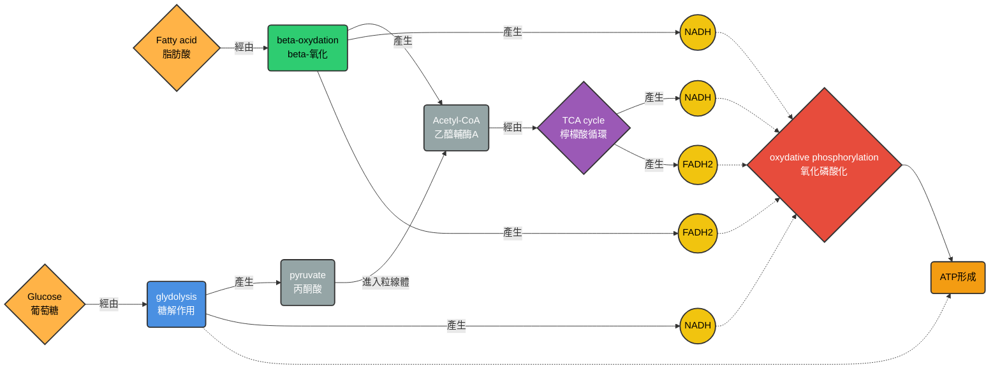
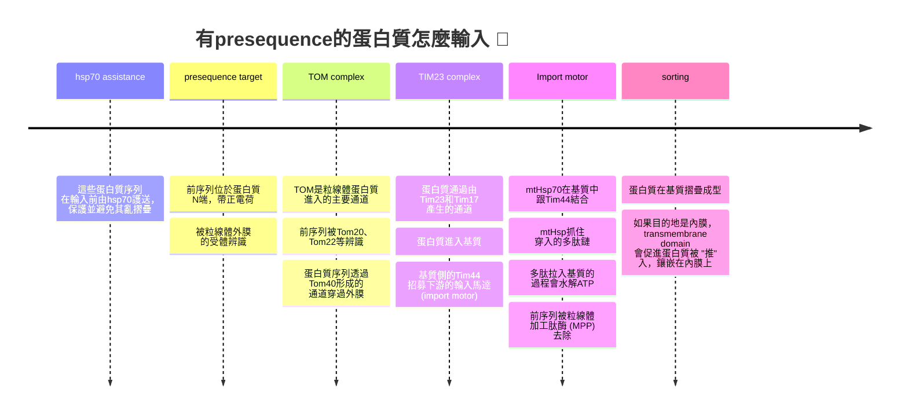

## W5: Mitochindria, Chloroplasts, and Peroxisomes I
### Mirochindria
#### structure
- 粒線體有兩層膜，由內膜跟外膜 (inner and outer membrane) 組成
- 內膜的褶皺 (cristae) 延伸到內膜的基質 (matrix) 中
- 基質裡面有粒線體的遺傳物質，以及進行有氧代謝的一系列酵素 (包含檸檬酸循環的酵素，或是脂肪酸進行 $\beta$ 氧化的酵素)
#### 組成樣貌
- 內膜表面嵌入不少進行氧化磷酸化的酵素 (包含電子載體複合體、泛醌、細胞色素、以及ATP合成酶)、以及代謝物運輸的酵素
- 內膜通常對大部分的分子都不通透，這種特性維持了質子梯度，這是氧化磷酸化的重要動力源之一
- 外膜對於小分子 (小於1000道爾頓) 有通透性，可以透過孔蛋白 (porins) 運輸 (屬於促進性擴散)
- 內膜也有特殊的脂質成分，被稱為cardiolipin，可以支持並穩定氧化磷酸化，使其更有效率

> [!Tip]
> 粒線體外膜的porin，跟細菌的porin結構上有相似之處 (屬於 $\beta$ 筒狀蛋白)，這其實也反應了粒線體可能來自於細菌的內共生假說 🐱

#### fusion and fission

- 粒線體可以溶合，也可以分開，融合的時候 (fusion) 可以促進遺傳物質交換，有時也會分裂 (fission)，確保細胞分裂時的粒線體數量 

#### 分解代謝途徑跟ATP生成

- ATP來自於葡萄糖或是脂肪酸的分解代謝
> 咱們接下來開始一一介紹 🐱

##### 1. glucose
- 一個葡萄糖透過10個酵素，形成兩個丙酮酸 (pyruvate)，pyruvate 在PDC (丙酮酸去氫酶複合體) 形成乙醯輔酶A (acetyl-CoA)
- acetyl-CoA和oxaloacetate (草醯乙酸) 結合，形成citrate (檸檬酸) ，進行TCA cycle (又被稱為檸檬酸循環，the citric acid cycle)
- TCA cycle期間會產生NADH，並且使酵素上的FAD還原，藉此促進coenzyme Q10 (又稱為泛醌，ubbiquinone) 的還原，撬動電子傳遞鏈 (ETC)
- ETC是維持質子梯度，以及導致氧化磷酸化 (oxydative phosphorylation) 的來源，這是身體大部分的ATP來源

##### 2. fatty acid
- 脂肪酸主要透過肉鹼 (carnitine) 穿梭機制進入粒線體，並且透過beta氧化形成大量的acetyl-CoA，在氧化期間會產生NADH，也會還原酵素上的FAD
- 這些產生的acetyl-CoA也是進一步透過TCA cycle形成NADH，還原FAD，並且透過氧化磷酸化形成ATP

##### 3. 氧化磷酸化到底是怎麼個事

- 整個ETC由多個電子載體組成。組成通常包含複合體I、複合體II、泛醌、複合體III、細胞色素C、複合體IV
- 其中，複合體I、III、IV，具有將質子打入膜間腔的能力，這造成了質子梯度
- 在NADH上的電子會被傳遞到內膜上的複合體I，NADH被氧化成NAD+
- FAD在酵素上被還原之後，電子會傳遞給泛醌，形成 $QH_2$ 

> [!Note]
> FAD在很多酵素上都有出現，包含PDC，以及ETC上的複合體II，這些酵素有一部份就是將電子傳給泛醌，因此FAD就是在酵素內，負責做電子 "中繼站" 的輔酶

- 電子從複合體I，一直傳給泛醌、複合體III、細胞色素C、複合體IV等等，最後從複合體IV離開，被氧氣所接收，氧氣因此還原，形成水分子

- 質子透過ATP合成酶 (ATP synthase) ，從膜間腔流入基質，同時合成酶轉動，促進ADP和磷酸基形成高能磷酸鍵，ATP生成
- 質子的流動受到兩個東西的影響: 第一個叫做濃度梯度 (也就是所謂的滲透壓)，第二個叫做電梯度 (因為質子帶電，膜間腔側會形成正電場，相對的基質側就是所謂的負電場)
- 這種位能差又稱為 "電化學梯度" ，促進質子從膜間腔往基質移動

#### 代謝物質的跨膜運輸
- 粒線體在發揮功能時，需要一些小分子有效率的進出粒線體
- 代謝物進出粒線體也受到電化學梯度的影響
- 例如，ATP-ADP轉運體就是透過這種電化學梯度，在內膜幫忙交換ADP跟ATP
- 而磷酸基跟丙酮酸的輸入，是透過它們在轉運體中，和 $OH^-$ 交換。因為在膜間腔裡面充滿質子的情況下，基質就相對的充滿 $OH^-$ 

> 大家可以點以下的影片來看看喔~ 👀
> 

#### 粒線體的基因
- 粒線體有屬於自己的遺傳物質，其基因組屬於好幾個環狀的DNA分子 (是不是跟細菌很像阿 😏)
- 基因組也編碼粒線體自己要的rRNAs、還有大部分自己需要的tRNA，其編碼的密碼子對應的胺基酸還跟細胞核不太一樣，例如:

|密碼子|通常對應的胺基酸|在粒線體中對應的胺基酸|
|---|---|---|
|UGA|終止密碼子|色胺酸 (Tryptophan)|
|AGA|精胺酸 (Arginine)|終止密碼子|
|AGG|精胺酸 (Arginine)|終止密碼子|
|AUA|異白胺酸 (Isoleucine)|甲硫胺酸 (Methionine)|

- 粒線體的基因組一部份編碼氧化磷酸化所需的蛋白質
- 但是大部分的粒線體蛋白質基因，其實99%都是在細胞和的基因組裡面，他們會在細胞質中的核糖體中被合成，然後被送入粒線體中
- 由於大部分受精卵中的粒線體是來自於卵母細胞 (oocyte)，基本上和粒線體DNA有關的遺傳疾病都是遺傳自母親 (即使精子的粒線體 "不小心" 進入卵子，也往往會被蛋白酶體降解)，例如:

| 疾病名稱 🤕 | 主要受影響器官or系統 🧠 | 臨床特徵 |
| --- | --- | --- |
| **MELAS（Mitochondrial Encephalomyopathy, Lactic Acidosis, and Stroke-like episodes）** | 腦、肌肉 | 中風樣發作、癲癇、乳酸堆積、肌肉無力 |
| **MERRF（Myoclonic Epilepsy with Ragged Red Fibers）** | 神經系統、肌肉 | 肌陣攣性癲癇、共濟失調、肌肉病變（紅色破碎纖維） |
| **LHON（Leber’s Hereditary Optic Neuropathy）** | 視神經 | 青年期急性或亞急性視力喪失，常為雙眼 |
| **NARP（Neuropathy, Ataxia, and Retinitis Pigmentosa）** | 神經系統、視網膜 | 周邊神經病變、共濟失調、視網膜退化 |

##### 備註: 粒線體替換療法
- 如果病患希望產下健康的後代，她可以透過利用捐助者的卵母細胞達成這點
- 將捐助者卵子的染色體人工移除，並且將病患的染色體植入，就形成一個有 "捐助者粒線體 + 病患染色體" 的卵子
- 最後再試管受精 (*in vitro*)，完成療程

#### 蛋白質運輸跟組裝
- 由於大部分粒線體蛋白質來自粒線體外面，如果是進入基質的蛋白質，需要穿過內膜跟外膜，而不同蛋白質還要被分配到屬於他們的位置，有些是鑲嵌在內膜上，有些是溶於膜間腔

#### 內膜的蛋白質組裝
##### 有前序列 (presequence) 的粒線體蛋白運輸
- 主要透過TOM/TIM系統運輸到粒線體中
- 步驟如下:

##### 無前序列 (presequence-independent) 的蛋白質

- 如果該序列沒有presequence，而且有多個跨膜序列，進入粒線體的方法有所不同
- 這種蛋白質通常有內部的訊號序列 (internal signal sequences)，從Tom complex進到細胞裡之後，蛋白質會跟Tim9-Tim10伴侶分子結合，被傳輸到Tim22複合體
- 內部信號序列會阻止蛋白質的translocation，蛋白質會被橫向 "推" 到內膜上面

##### 非從外轉入的蛋白質
- 有些蛋白質由粒線體的基因組產生，這些蛋白質會在粒線體的基質被轉譯出來，並且透過Oxa1 translocase被 "推" 入內膜

#### 外膜跟膜間腔的蛋白質組裝
- 如果Tom complex讓多肽能穿過外膜，那在外膜上的Min1通道蛋白，就是直接幫忙把多肽 "推" 到外膜上面去
- 對於外膜的 $\beta$ -筒狀蛋白的前驅物，是先從Tom complex穿過外膜之後，透過Tim9-Tim10伴侶分子結合，然後Tim9-Tim10會幫忙把蛋白質送到SAM complex (**S**orting and **A**ssembly **M**echinery)
- 至於膜間腔的蛋白質，是通過Tom complex之後，由膜間腔的伴侶分子結合，直接在裡面進行折疊後產生功能

#### 脂質的運輸
- 粒線體的脂質由細胞的光滑內質網合成，但是運輸方式不是靠形成囊泡融合到膜上面，而是透過磷脂轉運蛋白 (phospholipid transfer protein)
- 它會從光滑內質網，每一次從內質網膜上面，轉移一個磷脂分子到粒線體外膜上面

---

### Chloroplasts
#### 結構
- 一樣有雙層膜，被稱為chloroplast envelope
- 除此之外，葉綠體還有第三層膜，這一層膜最終形成thylakoid (類囊體)，這東西堆疊在一起，就形成grana (葉綠餅)
- 內部區域也可以分成三種:
  - 膜間腔 (intermembrane space)
  - 基質 (stroma)
  - 類囊體質液 (thylakoid lumen)
- 和粒線體一樣，葉綠體也可以分裂複製 

#### 組成樣貌
- 和粒線體一樣，外膜表面也有可通透的孔蛋白 (porins)
- 內膜對於多數的物質 (甚至是離子) 不通透，需要用專屬的transporters進入內膜
- 基質中包含葉綠體自身的遺傳物質，以及一些代謝酵素 (例如在光合作用中進行固碳反應的酵素)

#### 一樣進行電化學梯度的磷酸化樣貌

|胞器|mitochondria|chloroplasts|
|---|---|---|
|形成ATP的機制|質子的電化學梯度|質子的電化學梯度|
|累積質子的地方|膜間腔|類囊體腔|
|ATPase位於|內膜|類囊體膜|
|ATP形成於|基質 (matrix)|基質 (stroma)|
|ETC電子來自於|NADP跟FADH2|水分子|
|最終電子接收者|氧氣 → 水分子|NADP → NADPH|

#### 光合作用介紹
- 光合作用分為兩個部分: **光反應** (light reaction) 跟**固碳反應** (也被稱為dark reaction)

##### 1. 光合磷酸化到底是怎麼個事
- 在光反應中，作用點就是位於類囊體上的電子傳遞鏈，組成通常包含光系統II、質體醌 (PQ)、細胞色素b6f、質體藍素 (PC)、光系統I、鐵氧還蛋白 (Fd)、NADP 還原酶
- 光系統接收光波，共有PSII (P680)跟PSI (P700)兩種光系統，它們接收到光波的能量後，會促進水分子氧化，產生電子，並且將電子傳下去，同時形成氧氣，從葉子的氣孔排出
- 電子最終會由NADP接收，還原出NADPH，同時質子梯度也會促進ATP synthase去形成ATP

##### 2. 固碳反應
- 固碳反應通常在葉綠體的基質進行，反應形式為卡爾文循環 (Calvin cycle)
- 透過利用底物RuBP，以及Rubisco催化反應，將二氧化碳合成出3-磷酸甘油酸 (3-phosphoglycerate)，這東西之後再透過其他代謝途徑，最終形成糖類

#### 葉綠體的基因組
- 包含環狀的DNA分子，通常在一個葉綠體裡面被拷貝了好多次
- 通常，葉綠體的基因組比粒線體的基因組更大，也更為複雜
- 和粒線體一樣，rRNAs跟tRNAs的基因是位於自己的基因組裡面，而且其密碼子的解讀形式跟通用的密碼子是一樣的
- 基因組編碼的40種核糖體蛋白，構成了核糖體大部分的構造
- 然而，依然有九成以上 (95%) 的葉綠體所需蛋白質，其實是位於細胞核內部的基因組裡面

#### 內膜的蛋白質組裝
##### TOC/TIC 系統
- 如果該蛋白質在N端有所謂的transit peptide (轉運肽，相當於粒線體蛋白的前序列)，該蛋白質會靶向葉綠體外膜上的TOC複合體
- Toc75主要組成複合體的內通道，Toc34和Toc159為辨識轉運肽的受體
- 傳輸多肽的時候，除了Hsp70本身需要ATP水解之外，TOC複合體也需要消耗GTP作為能量來源
- 一旦穿過外膜，轉運肽會先穿過內膜上的TIC複合體 (該複合體跟TOC複合體有透過一亞基連結)
- Hsp93幫忙拉動多肽穿過TIC複合體，而轉運肽被基質加工肽酶 (SPP) 移除

#### TOM/TIM 和 TOC/TIC 比較

|胞器|mitochondria (TOM/TIM)|chloroplast (TOC/TIC)|
|---|---|---|
|多肽信號肽位置|N端，被稱為presequence|N端，被稱為transit peptide|
|信號肽特性|多帶正電|較少帶電而且序列較長|
|辨識信號肽的受體|Tom20、Tom22|Toc34、Toc159|
|Hsp70是否會消耗ATP|會✅|會✅|
|穿過外膜是否需要高能磷酸鍵的水解|不需要❎|需要消耗GTP✅|
|內膜轉位角色|Hsp70，消耗ATP|Hsp93，消耗ATP|
|誰負責切除信號肽|MPP|SPP|

