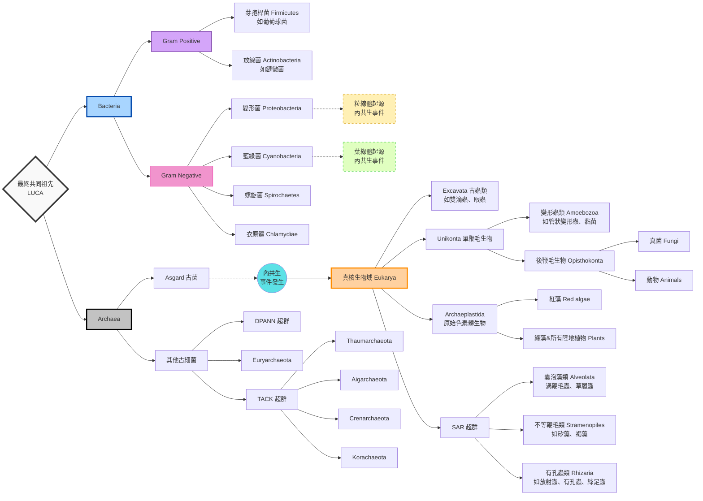
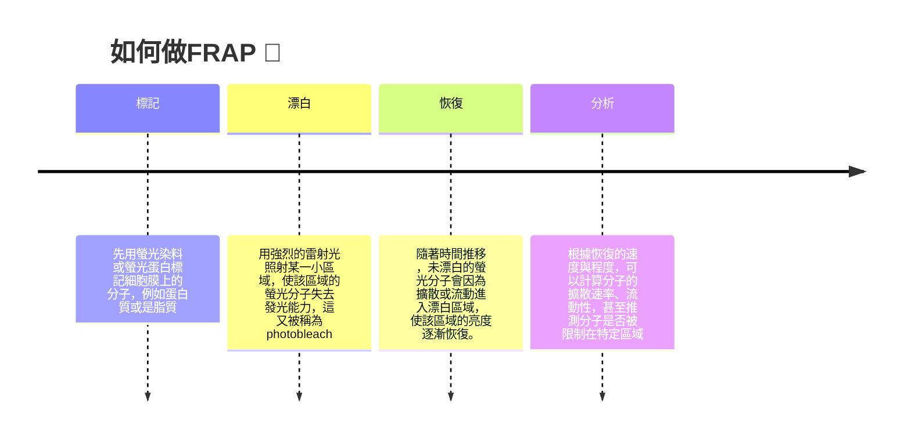
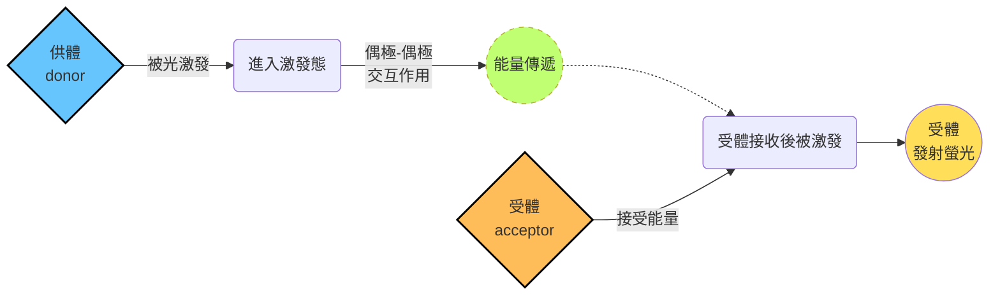
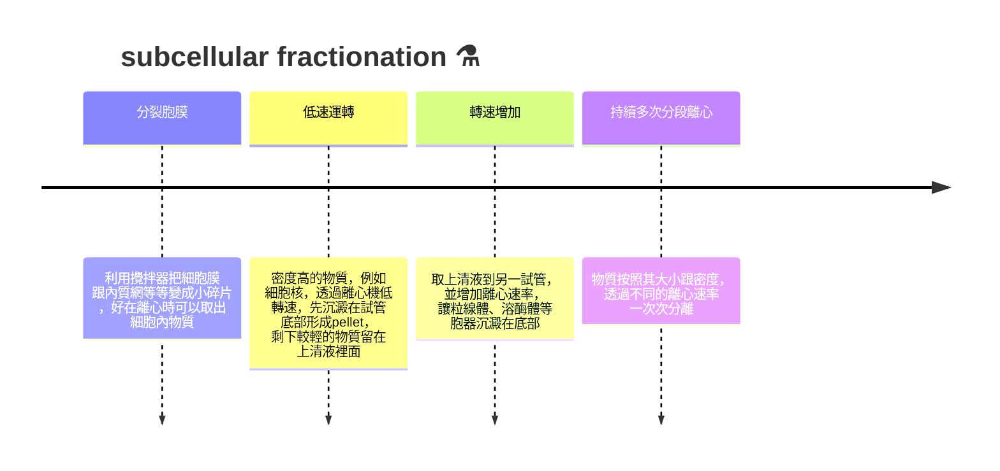

## W1: Introduction to cell and cell research
### Cell & cell biology
#### what is cytology?
- cell=生物的基本單位。生物要麼以細胞組成，或著個體就是一個細胞
- 細胞會變化、活動。能夠自我生長、繁殖跟形成特殊功能 (也就是專門化，specialized，細胞分化而來)
- 細胞分化後能夠對外界刺激形成反應
#### The cell theory
> 基本上分為三大部分:
- 所有個體由一個或多個細胞組成
- 細胞=所有生物體的基本單位
- 細胞只能來自於細胞
#### Evolution of Cells
- 第一個生命共同祖先 (LUCA) 分支出了兩個原核生物域 (domains): 古菌和真細菌域。如下:

- 真核生物域 (Eukarya) 的形成，來自於一個古菌吞噬了$\alpha$-proteobacteria產生 (這個$\alpha$-proteobacteria，就是我們所知的粒線體祖先)
- 這個狀態被稱為內共生 (endosymbiosis)
- 目前發現，真核生物的遺傳物質是細菌跟古菌的基因混合
- 多數跟基因表現過程有關的基因 (例如DNA複製、轉錄跟轉譯) 來自於archaea
- 而多數的細胞基本代謝途基因 (例如糖解或是胺基酸合成) 來自於bacteria

||Prokaryote 🦠|Eukaryote 🐟|
|---|---|---|
|是否有Nucleus|無 ❎|有 ✅|
|細胞大小|約1微米左右|大約10~100微米|
|是否有帶膜的胞器|無 ❎|有 ✅|
|DNA 大小|約 $10^6$ bp左右|約 $10^8$ bp左右|
|染色體形式|單一環狀DNA|多個線狀DNA|

- 植物跟藻類等，除了和粒線體內共生，也和葉綠體 (前體為cyanobacteria) 有內共生

#### bacterial cell structure
- 細菌有細胞壁，由peptidoglycan組成，細胞壁下就是細胞膜 (plasma membrane)，DNA聚在一起，形成類核體 (nucleoid)
- 細菌也有核糖體，有些細菌有鞭毛 (flagella)、質體 (plasmid)、菌毛 (fimbriae)、外膜 (capsule) 等等

#### animal & plant cells structure
- 所有動植物都含有細胞膜、細胞核、細胞骨架、以及一些共同胞器 (如mitochondria、ER、Golgi apparatus等)
- 植物細胞比動物細胞多了chloroplast、細胞壁，以及一個巨大的液泡 (vacuoles)

#### what about multicellular organisms? 👀
##### Animal
- 動物的細胞分化成了非常多種，而相同功能的細胞會形成組織 (tissue):

|種類|功能|可發現在|
|---|---|---|
|上皮組織 Epithelial tissues|保護、吸收、分泌|皮膚、小腸內壁、口腔皮膜|
|硬骨組織 Bone tissues|支持身體，例如成骨細胞osteoblasts|骨骼、牙齒|
|軟骨組織 Cartilage tissue|支持跟保護作用|椎間盤、鼻樑、耳廓|
|血液組織 Blood|輸送養分、傳送代謝廢物跟氣體，細胞類型包含erythrocytes、leukocytes|血管內部|
|神經組織 Nervous tissues|動作電位傳遞，包含neurons、microgila、astrocytes等|大腦、脊隨|
|肌肉組織 Muscles|產生作用力、促進身體運動，包含骨骼肌、平滑肌、心肌|血管壁、消化器官、骨骼周圍|

##### Plants
- 植物的組織種類通常較少:

|種類|功能|舉例|
|---|---|---|
|基本組織 Ground tissues|植物的基本支持功能、代謝等|薄壁細胞、厚角細胞、厚壁細胞|
|表皮組織 Dermal tissues|保護、控制物質進出|epidermal cell|
|維管束組織 Vascular tissues|水分、礦物質或是有機物的傳送|xylem and phloem|

---

### Model organisms in cell biology
- 在實驗中往往會用不同生物，或是細胞來做實驗
#### 經典模式生物簡介
##### 大腸桿菌 E.coli 
- 構造簡單，基因組中等
- 用於分子生物學，可研究包含基因複製、基因表現、蛋白質合成等
##### 酵母菌 Saccharomyces cerevisiae
- 出芽生殖，屬於最簡單的真核生物之一，單細胞
- 有類似大腸桿菌的實驗優勢，但其具有細胞核、16條染色體、胞器，可做更多不同的研究
##### 草履蟲 Tetrahymena thermophila
- 單細胞的雙核微生物
- 曾經透過它發現了端粒酶 (telomerase) 還有核糖核酸酶 (ribozyme) 的存在
##### 秀麗隱桿線蟲 Caenorhabditis elegans
- 多細胞的動物，作為研究動物的發育和細胞分化為主
- 在基因上面的數量跟人類的基因樹相似
##### 果蠅 Drosophilia melanogaster 🪰
- 也是發育生物學的主角之一
- 可用來研究基因跟染色體的關係，以及找出調控細胞發育跟分化的基因
##### 阿拉伯芥 Arabidopsis thaliana 🌿
- 最常見的，用來研究植物發育學的物種
- 開花植物，因此也能用來研究跟花的形成有關的基因
##### 斑馬魚 Danio rerio 🐟
- 可用來研究脊椎動物的發育過程
- 其胚胎發育早期的樣貌，跟多數脊椎動物類似
##### 小家鼠 Mus musculus 🐁
- 哺乳動物，親緣關係跟人類接近的模式生物
- 基因組大小跟基因數量皆和人類類似
- 很多在同源基因上面出現的突變，從人類移植到老鼠身上，也會出現類似的效果
- 在藥物上面可用於體內測試 (*in vivo*)

#### 用於實驗的其它媒介
##### stem cell
- 具有潛能性
- 用於研究細胞發育跟分化
- 可用於移植治療，例如白血病患者的骨髓移殖
##### immortal cell
- 例如癌細胞 (最著名的典型例子就是HeLa cell，來自一位女性Henrietta Lacks的子宮頸癌腫瘤細胞)
- 病毒裡面的一些基因，會影響細胞週期，從而導致細胞不正常增生
- 有些酵素也跟細胞的壽命關係，例如端粒酶 (telomerase)

##### Viruses
- 一種無法自行複製的病原體，通常要在細胞內才能複製自己的基因
- 透過感染宿主細胞繁殖，利用宿主細胞自己的複製機制來複製自己
- 通常僅包含遺傳物質 (DNA or RNA) 以及蛋白質外殼
- 用來研究DNA的複製跟轉錄 (產生遺傳物質&外殼)，也可以作為遺傳物質載體 (例如lentivirus)
- 有些病毒會將自己的DNA嵌入宿主細胞 (如herpesviruses、retroviruses)，因此可能干擾宿主的細胞週期，誘發癌症

---

### Investigation of cell biology
#### 特性
- Resolution = 你能辨識物體的程度。通常會用 "還能分開辨識兩個物體的物體間最小距離" 為定義
- 解析度的極限越小，其解析能力越強

- Magnification = 放大的倍率，在光學顯微鏡上，通常跟物鏡 (objective lens) 跟目鏡 (eyepiece lens) 的種類有關
- 關係如下:
$$\text{magnification}=\text{目鏡倍率}\times\text{物鏡倍率}$$
#### 補充: 解析度計算
- 假如說解析度為$d$，根據Abbe定律，$d$ 可表示為:
$$d=\frac{0.61\cdot\lambda}{NA}$$
- 其中
  - $\lambda$ 為光的波長，波長越短，$d$ 越小，因此解析度越高
  - $NA$ 為物鏡的數值孔徑，滿足: 
$$NA=n\cdot\sin\theta$$ 
  - $n$ 為介質的折射率，$\theta$ 為物鏡能收集光的最大角度
  - 因此 $NA$ 越大，物鏡聚焦時離樣本越近，解析度越好
#### 光學顯微鏡 LM
##### 亮視野顯微鏡
- 在顯微鏡下的樣本為白底，通常會使影像對比度不足
- 通常樣本會被化學藥劑跟染劑固定 (fixed) 和染色，用於觀察遺傳物質或是蛋白質，這些樣本通常是死的
##### 相位差顯微鏡 Phase-contrast microscope
- 光的干涉和相位差轉換成亮度差，增加對比
- 可觀察不染色的活細胞
##### 微分干涉對比顯微鏡 DIC
- 偏光干涉增加對比
- 和相位差顯微鏡一樣，可以觀察不染色的活細胞

> [!Note]
> 更多相位差和DIC的差別，可以[點擊這裡看看](https://micro.magnet.fsu.edu/primer/techniques/dic/dicphasecomparison.html)👀

##### 螢光顯微鏡 Fluorescence Microscope
- 利用一些特殊螢光蛋白 (例如水母的GFP) 標記任何想要看的蛋白質
- 不同螢光蛋白標記不同的物質，做整合的時候就可以知道每個蛋白的位置跟功能

- **光漂白後螢光恢復** (fluorescence recovery after photobleaching, FRAP) ，用來研究分子在細胞中流動的技術，原理可以分成幾個步驟:

- **螢光共振能量轉移** (fluorescence resonance energy transfer, FRET)，用來研究分子之間的距離和相互作用
> [!Tip]核心概念: 
> 兩個螢光蛋白非常靠近的時候，原本要激發產生螢光的分子把能量傳給旁邊的分子 ! ✨

##### 共軛焦顯微鏡 Confocal microscope
- 為了解決傳統顯微鏡的影像會 "糊成一團" 的問題，它透過一個小孔，讓2D的影像有3D的層次
- 焦平面以外的光 (又稱為散焦光) 如果一起進入鏡頭，會讓整個畫面看起來灰濛濛的
- 因此共軛焦顯微鏡用了雷射掃描 (一次聚焦一個小地方就好) + 針孔 (擋掉散焦光讓畫面清楚)，一點一點把畫面 "拼回" 原貌
> [!Tip]也就是說:
> 想像每一次聚焦是看到一個像素點，電腦把一堆像素點做成一層切面，然後好多個平面疊在一起，就變成立體的細胞! ✨

#### 電子顯微鏡 EM
- 分為掃描式 (SEM) 跟穿透式電子顯微鏡 (TEM)
- 電子顯微鏡分成兩種: SEM跟TEM

|特徵	|SEM（Scanning Electron Microscope）|TEM（Transmission Electron Microscope）|
|---|---|---|
|原理|電子束逐點**掃描樣品表面**，收集二次電子、背散射電子等訊號|高能電子束**穿透樣品**，透射電子攜帶內部結構訊息形成影像|
|觀察|表面形貌、粗糙度、顆粒分布、斷口特徵|內部結構：晶體結構、晶格缺陷、位錯、層錯等|
|圖像的樣貌|三維立體感強，景深大，直觀易懂|二維投影圖像（明場像、暗場像、高分辨像），可解析晶格條紋|
|解析度|約 0.5 nm|更高解析度，可達 < 50 pm|
|觀察樣本的特徵|樣品厚度無嚴格限制，非導電樣品通常需鍍金或碳|樣品必須非常薄（通常 < 100 nm，高解析需 < 10 nm），製備困難|

#### 如何分離物質
- 通常利用離心來進行細胞層級以下的分類，大致過程為:

- 離心也有分成不同種類，例如密度梯度分離法，通常使用蔗糖當溶液，濃度上低下高，根據特性還可以細分成: 

||velocity centrifugation|equilibrium centrifugation|
|---|---|---|
|原理|根據沉降速度的不一樣來分離|根據顆粒於離心力跟擴散力之間，達到平衡來分離|
|分離依據|顆粒的沉降速率|顆粒的浮力密度|
|結果|顆粒在試管中暫時形成不同層的條紋，但是時間一長會沉在底部|顆粒停留在跟自己密度相等的梯度位置，不再繼續沉降|
|用於|簡單分離不同大小或是形狀的顆粒|分離或是純化DNA (例如進行驗證DNA半保留複製時，使用CsCl溶液來分析)|