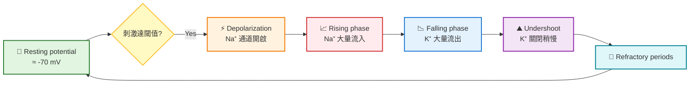

## W8-1: The Cytoskeleton and Cell Movement III
### before we start the class...
#### sarcomere結構複習
- 肌節為肌肉的收縮單位，每個收縮單位由Z disc分隔，屬於一個對稱結構 (對稱軸被稱為M line)
- 分為粗肌絲 (由myosin II組成)，以及細肌絲 (主要由actin組成，上面纏繞著tropomyosin以及nebulin固定其架構)
- 細肌絲黏在Z disc 上面，黏著端屬於plus end
- 粗肌絲並沒有黏在Z disc上面，而是透過附著在Z disc上的titin跟其相連，titin看起來有點像是彈簧一樣，從Z disc延伸到M line，使myosin保持在位於肌節中間的位置
- 在每個肌節裡面，有暗帶 (A bands) 跟亮帶 (I band)，一個肌節，就是兩個亮帶，中間有一個暗帶。A band最中間有個區域，只有myosin，這區域被稱為H zone

    

#### myosin
- 走在actin filament上面的motor protein，有各種不同的形狀
- myosin II 結構由兩個單體組成，一條為chain加上一個頂端的球狀區域，另一條單體為兩條 $\alpha$ -helix組成的纏繞鏈，加上一個頂端的球狀區域，然後這兩個單體再纏繞在一起，形成像是 "黃豆芽菜" 形狀的東西
- myosin I類似於myosin II的結構，但是屬於單體 (只有一個頭跟一個尾巴)，不會形成二聚體跟聚集成絲狀結構，而且尾巴也比較短 (長得像是蝌蚪)
- myosin V跟myosin II一樣屬於二聚體，但是有頭有腳
- 三個myosin的head domain都附著在actin filament上面，並且需要ATP水解才能動，而尾巴或是腳的區域 (也就是light chain) 負責載送東西，例如囊泡

    

#### kinesin and dynein
- 兩個都是走在微管上的motor protein
- kinesin I把囊泡跟胞器等往plus端方向動，運到細胞外周
- dynein 則是把貨物往minus方向移動，往中心跑去
- 都需要ATP水解才能運作

> 讓我們正式開始我們的課程吧... 🐱

---

### intermediate filament
- 通常跟細胞運動的關係不大 (不像是actin filament以及microtubules)
- 主要功能就是 "提供機械支持"，而且在細胞內信號傳遞裡面發揮作用
- 通常中間絲不存在於真菌、植物、或是一些昆蟲身上
- 中間絲並不是僅由一種蛋白構成，而是由不同家族，但是結構相似的蛋白形成
- 根據你的細胞類型不一樣，中間絲的主要成分也會有所差異

| 類型 | 主要蛋白 | 分布位置 | 功能特點 |
| --- | --- | --- | --- |
| **I、II 類** | 酸性與鹼性角蛋白 (keratins) | 上皮細胞 | 提供機械強度，維持皮膚與上皮組織完整性 |
| **III 類** | 波形蛋白 (vimentin)、結蛋白 (desmin)、膠質纖維酸性蛋白 (glial fibrillary acidic protein, GFAP)、外周蛋白 (peripherin) | 中胚層來源細胞、肌肉、星形膠質細胞、周邊神經元 | 維持細胞形態、肌肉纖維結構、神經支持 |
| **IV 類** | 神經絲蛋白 (NF-L, NF-M, NF-H)、 $\alpha$ -internexin、nestin、synemin | 神經元 | 穩定軸突結構，影響神經訊號傳導 |
| **V 類** | 核纖層蛋白 (lamins A, B, C) | 細胞核 | 維持核膜形態，參與染色質組織與基因調控 |
| **VI 類** | 晶狀蛋白 (phakinin)、菲列辛蛋白 (filensin) | 水晶體細胞、神經幹細胞 | 特殊結構支持，與晶狀體透明度相關 |

#### 中間絲的組裝
- 主要單位為一條中間為 $\alpha$ -helix，N端為頭，C端為尾的多肽組成
- 然後兩條單位的多肽纏繞在一起，形成dimers (二聚體)
- 兩個dimers以反平行的方法，形成tetramers (四聚體)
- 然後tetramer頭尾相連串連在一起，形成了原絲 (protofilament)
- 然後，每一條中間絲，通常都是由八條原絲組合在一起，形成像是繩子一樣的結構
- 不像是actin filaments或是microtubule一樣有所謂的 "極性" (也就是分得出plus跟minus ends)，它並沒有明顯的末端，這被稱為 "無極性" (apolar)
- 它們的組裝跟解體是由磷酸化調控的

#### 核纖層 (nuclear lamina) 的架構
- 在之前談論細胞核的章節有提到，核纖層位於核膜內側，作為細胞核的結構性支持，由核纖蛋白 (lamins) 作為單元組成
- 跟許多的中間絲結構一樣，lamins也有頭有尾，會形成dimers跟tetramers，並且tetramer串連在一起形成filament的基本構造

    

#### keratin
- 中間絲其實也可以跟actin filaments以及microtubules相互作用或是結合
- 角蛋白 (keratin) 從圍繞細胞核的環狀結構延伸到細胞膜
- 頭髮屬於角質化的死細胞，這讓頭髮在結構上變得很穩固
- 上皮細胞的角蛋白主要固定在細胞膜上面的兩種區域，也就是desmosomes以及hemidesmosomes (中文上被稱為 "橋粒" 跟 "半橋粒")
> [!Note]
> 所謂沙龍上出現的 "角蛋白護理"，只是讓細胞上有縫隙跟裂痕的地方 "填平"，在**不破壞結構**的情況下，讓頭髮 "看起來" 比較光滑而已 💇‍♀️

#### the structure of desmosome 🧩 
##### 跨膜的黏著蛋白區域
- 由Desmoglein (Dsg) 與 Desmocollin (Dsc) 組成
- 屬於cadherin家族，伸出細胞膜外，與鄰近細胞的對應分子互相 "扣合"

##### 胞質錨定蛋白
- 包含Plakoglobin (γ-catenin) 以及 Plakophilin
- 這些蛋白位於細胞膜內側，負責把跨膜cadherin分子連接到內部骨架

##### 內部連接蛋白
- 被稱為Desmoplakin
- 是最核心的 "橋樑"，把整個複合體固定到中間絲

##### 細胞骨架連結
中間絲 (例如keratin 或 desmin) 從細胞質延伸過來，插入 desmoplakin，形成強韌的網絡

    

#### the structure of hemidesmosomes
- 細胞由跨膜蛋白integrin $\alpha 6 \beta 4$ (兩個次單元分別為integrin $\alpha 6$ 跟 integrin $\beta 4$ ) 連結到細胞外基質，而integrin透過plectin跟中間絲連接
- 其中，BP180跟BP230負責調控hemidesmosome的組裝以及穩定性

#### 來做個小比較

| 特徵 | **Desmosome（橋粒）** | **Hemidesmosome（半橋粒）** |
| --- | --- | --- |
| **主要功能** | 連結 **細胞與細胞** | 連結 **細胞與基底膜** |
| **跨膜蛋白** | Desmoglein、Desmocollin（cadherin 家族） | Integrin $\alpha 6 \beta 4$ 、BP180 (collagen XVII)、CD151 |
| **胞質連接蛋白** | Plakoglobin、Plakophilin、Desmoplakin | BP230、Plectin |
| **連結骨架** | 中間絲 | 中間絲 |
| **定位** | 上皮細胞之間的側面 | 上皮細胞基底面，與基底膜相連 |

### 作業小練習
- 以下為actin filaments、microtubules、intermediate filaments的分類 😏

|feature|actin filaments 微絲|microtubules 微管|intermediate filaments 中間絲|
|----|----|----|----|
|**亞單元**|actin|$\alpha$ -tubulin and $\beta$ -tubulin|多種蛋白質都有可能 (keratins, vimentin, desmin, GFAP, NF, etc)，取決於細胞種類|
|**直徑**|約 7 nm|約 25 nm|約 10 nm|
|**結構**|G-actin 聚合成 F-actin，呈雙股螺旋|$\alpha$ -tubulin and $\beta$ -tubulin 二聚體沿微管壁排列，形成13條protofilaments，圍成中空管|兩股有N端頭跟C端尾的polypeptide先形成coiled-coil的dimers → tetramer串聯形成protofilament，八條protofilaments形成一條纖維|
| **極性 (plus/minus end)** | 有極性，+端快速生長 | 有極性，+端快速生長 | 無極性 |
| **動態性** | 高度動態，快速聚合/解聚 | 高度動態，具「動態不穩定性」 | 穩定，較少重組 |
| **動力蛋白** | Myosin | Kinesin (往+端)、Dynein (往−端) | 無已知動力蛋白 |
| **主要功能** | 細胞形狀維持、細胞移動 (lamellipodia, filopodia)、內吞/胞吐作用 | 細胞內運輸 (囊泡、細胞器)、有絲分裂 (形成紡錘體)、鞭毛/纖毛運動 | 提供機械強度、抵抗拉力、維持細胞核完整性 |
| **位於** | 細胞皮層 (cortical region)，緊貼膜下 | 從中心體向外輻射至細胞周邊 | 分布於細胞質，連接核膜與細胞膜 |

---

## W8-2: The Plasma Membrane
### introduction to the plasma membrane
#### 前情提要
- 所有細胞都由細胞膜圍起，讓細胞內部跟外部環境阻隔
- 細胞膜主要是磷脂質的脂雙層結構 (thephospholipid bilayer)，對大部分的可溶性小分子都不通透

#### 五大磷脂質
- 這五種磷脂質佔了細胞膜一半以上的脂質
- 其中，只有sphingomyelin的骨架不是由甘油組成的

##### Phosphatidylethanolamine (PE)
- 骨架: glycerol
- 尾巴: 兩條脂肪酸鏈
- 頭基: 乙醇胺 (ethanolamine，結構上為 $-CH_2 -CH_2 -NH_3^+$ )
- 特徵: 頭基小，容易形成 "錐形分子"，促進膜的彎曲

##### Phosphatidylcholine (PC)
- 骨架: glycerol
- 尾巴: 兩條脂肪酸鏈
- 頭基: 膽鹼 (choline，結構上為 $-CH_2 -CH_2 -N^+(CH_3)_3$ )
- 特徵: 頭基大，呈 "圓柱形分子"，有助於形成平坦的雙層膜

##### Phosphatidylinositol (PI)
- 骨架: glycerol
- 尾巴: 兩條脂肪酸鏈
- 頭基: 肌醇環 (inositol ring，六碳環，帶多個 $-OH$ 基團)
- 特徵: 可被磷酸化成 $PIP_2$ 或是 $PIP_3$ ，參與訊號傳導

##### Phosphatidylserine (PS)
- 骨架: glycerol
- 尾巴: 兩條脂肪酸鏈
- 頭基: 絲胺酸 (serine，結構上為 $–CH_2 –CH(NH_3^+)–COO^-$ )
- 特徵: 帶負電荷，通常位於細胞膜內層，與凋亡訊號相關

##### Sphingomyelin (SM)
- 骨架: 鞘氨醇 (sphingosine)
- 尾巴: 兩條脂肪酸鏈
- 頭基: 磷酸膽鹼 (phosphocholine)
- 特徵: 常見於髓鞘，結構較剛硬

    

#### 分布位置
- 外層 (outer leaflet) 的磷脂質主要成分為phosphatidylcholine (PC)跟sphingomyelin (SM)
- 內層 (inner leaflet) 的磷脂質主要成分為phosphatidylethanolamine (PE)跟 phosphatidylserine (PS)

> [!Important]
> - sphingomyelin合成的時候位於Golgi body的內側 (也就是luminal的那一側)，而其他磷脂質是在smooth ER合成的
> - 這些脂質可以用**Flippase** (從外膜轉到內膜) 或是**Floppase** (從內膜轉到外膜) 等酵素來幫助移動

- 糖脂質 (glycolipid) 只會在脂雙層的外膜出現
  - 它們的糖的部分會在細胞表面暴露，這些糖的修飾是在Golgi body實現的
  - 相對其他磷脂質來說，糖脂質的含量較少
- 膽固醇在動物細胞膜中常見，其分子數量通常跟磷脂質的分子數量是差不多的 (不過也會視情況而改變其組成密度)
- 由於膽固醇對於sphingomyelin有比較大的親和性，所以膽固醇常常在脂雙層外層比較多

    

#### 磷脂形成的組織結構
- sphingomyelin跟膽固醇常常聚集在一起，形成所謂的 "脂筏" (lipid raft)
- 脂筏屬於膜上面的一個 "有序微區"，結構更厚，流動性也較低，可以把特定蛋白質聚集在一起，提高信號傳導的效率
- 其屬於暫時的結構，能動態組裝跟解體，沒有信號時散落，有信號時聚集起來

    

#### caveolae
- 拉丁文上就是 "小洞穴" 的意思 (取名這麼隨性的嗎? 🫠) 
- 是由蛋白質caveolin-1, -2, -3等等插入膜中形成的，caveolin會跟細胞質蛋白cavin相互作用，協助穩定caveolae的形態
- 功能包含:
  - 訊號平台: 集中受體與訊號分子，調控訊號傳導 (如 $NO$ 合成、胰島素訊號)
  - 內吞作用: 透過caveolae-mediated endocytosis進行分子的攝取 (與我們平常知道的clathrin-mediated endocytosis有所不同)
  - 機械感應: 在血管內皮細胞中，caveolae可感應剪切力與張力
  - 脂質調控: 參與膽固醇與脂質的分布與運輸

    

#### 流體鑲嵌模型
- the fluid mosaic model認為，細胞膜是有動態性的，由脂雙層結構組成，並且蛋白質是 "鑲嵌" 在膜的上面，不一定會固定 (就像是水池中的球一樣會水平移動)
- 就算這些蛋白質要固定在原地，多數原因也是因為膜微區 (例如剛剛提到的lipid raft或是lipid domains)，或是細胞內部的骨架導致
- 同時，這些脂質分子也可以橫向流動，使膜具有柔韌性
- 驗證方式: 
   - 將老鼠跟人類的細胞做融合，融合之前用不同螢光物質標記了人類細胞膜上的蛋白質，以及老鼠細胞膜上的蛋白質
   - 融合後做觀察，可以發現兩者的蛋白質均勻的分布在膜上面

#### 相關的膜蛋白
- 膜蛋白分成integral membrane proteins (整合型膜蛋白) 和 peripheral membrane proteins (周邊型膜蛋白)
- 它們的差異主要在 "嵌入程度" 與 "和膜的互動方式":

| 特徵 | **Integral membrane proteins** | **Peripheral membrane proteins** |
| --- | --- | --- |
| **嵌入程度** | 深入嵌入脂雙層，通常跨膜 | 不直接插入脂雙層，只附著在膜表面 |
| **結構特徵** | 具有 **疏水性跨膜區域**（α-螺旋或 β-桶狀結構），可跨越膜 | 透過 **靜電作用、氫鍵或與其他膜蛋白結合**附著 |
| **移除方式** | 需用強烈方法（如去污劑、界面活性劑）才能抽出 | 較容易，用鹽溶液或 pH 改變即可去除 |
| **功能** | 作為通道蛋白或是載體蛋白，也可做為受體跟黏著分子 | 作為訊號傳遞調節、錨定或支撐與細胞骨架連結 |
| **位置**| 橫跨膜或嵌入膜內 | 附著在膜的內側或外側表面 |

#### the glycocalyx
- 一種包裹在細胞膜表面，由碳水化合物形成的結構
- 因為細胞膜上面有很多糖蛋白跟糖脂質，它們的寡糖結構通常暴露在外面，看起來像是一層獨立結構似的
- 可以做為保護細胞膜，避免機械壓力的盔甲，也可以避免微生物的入侵
- 除此之外，它也扮演細胞之間交互作用的角色

#### 上皮細胞的極化現象
- 有些細胞 (例如腸道的上皮細胞) ，細胞膜有極化的現象:
  - 靠近消化道的那一側細胞膜 (apical) 表面布滿微絨毛，負責吸收營養物質
  - 靠近基底的那一側細胞膜 (basolateral) 負責幫忙把吸收的營養物質轉移到下方的結締組織，這些結締組織含有微血管
  - 這兩側的細胞膜透過tight junction分開來，因此，兩個區域的蛋白質不會跑到對方的領域去

    

### facilitated diffusion
#### definition
- 促進性擴散，分子根據濃度梯度或是電位梯度移動，不需要ATP的參與
> [!Important]
> 促進性擴散屬於被動運輸 (passive transport) 的一種，但不是所有被動運輸都屬於促進性擴散 !! 🐱

- 促進性擴散可以利用載體蛋白 (carrier protein) 或是通道蛋白 (channel protein) 幫助
#### carrier protein
- 膜蛋白會出現構向上的變化，通常用來運輸醣類、蛋白質等等
- 分子可以由內而外，也可以由外而內移動

#### channel protein
- 就是一個開放的通道或是孔，讓小分子通過 (例如水通道蛋白)

    

#### ion channel proteins
- 離子通道蛋白有三個特性: 運輸速度很快 (相對於載體蛋白而言)、高度選擇性滲透、多數有受到門控調節 (特定情況才會開啟)
- 電壓門控 (voltage-gated channels)
   - 這種通道只有在特定的膜電位下才會開啟
   - 神經元就是用電壓門控離子通道，使離子擴散，來產生動作電位
   - 通常從神經元的軸丘，也就是axon hillock，開始傳遞
- 配體門控 (ligand-gated channels)
   - 只有通道在跟配體結合時，通道才會打開
   - 在動作電位傳遞上，神經傳遞物 (neurotransmitters) 往往就是種配體，它由突觸前神經元釋放
   - 神經傳遞物結合到突觸後神經元的離子通道上，使離子擴散，動作電位繼續傳遞

### neurotransmission
#### 神經元之間的傳導
- 在突觸前神經元末端，含有神經傳遞物的囊泡 (也就是突觸小泡)，會透過特定的SNAREs蛋白質錨定在軸突末梢的細胞膜上面
- 動作電位的到達會促進電壓門控鈣離子通道的打開，導致鈣離子進入細胞
- 這會活化synaptotagmin，該蛋白質會誘導由SNAREs錨定的囊泡跟細胞膜融合
- 神經傳遞物釋放到突觸後神經元，跟配體門控鈉通道結合，使其去極化，動作電位接續傳遞

    

##### 複習: 囊泡中的神經傳遞物如何被釋放出去? 🤔
1. **囊泡運送到目的地**
   - 囊泡表面有 Rab GTPases，它們像 "地址標籤"，幫助囊泡找到正確的膜
   - Rab 與 tethering factors (錨定蛋白) 互動，讓囊泡靠近目標膜
2. **SNARE 蛋白的辨識與配對**
   - 囊泡上的 v-SNARE (vesicle SNARE) 與目標膜上的 t-SNARE (target SNARE) 結合
   - 它們纏繞在一起，形成一個 "四股螺旋束"，像拉鍊一樣把兩個膜拉近
3. **膜融合**
   - 當膜距離足夠近，脂雙層會重新排列，形成融合孔
   - 囊泡內容物釋放到目的地 

#### $Na^+ - K^+$ pump
- 鈉鉀幫浦通常是為了幫忙維持滲透壓的平衡。在靜止神經膜電位上，它負責幫忙維持鈉離子跟鉀離子在細胞內外的 "不平衡"
- 在靜止膜電位時，胞外的鈉離子多，胞內的鉀離子多，鈉鉀幫浦就是不斷將鈉離子丟出去，並且將鉀離子拿進來
- 這個過程需要ATP水解產生的能量幫忙 (因為維持這樣的離子不紅並不是熱力學上的有利方向)

    

### active transport
#### 腸道上皮細胞的葡萄糖轉運
- 其核心在 $Na^+$ /glucose symporter (SGLT1)

##### 建立濃度梯度
- 在basolateral側的膜有 $Na^+ - K^+$ pump，這樣在細胞內形成低 $Na^+$ 濃度，而腸腔外 $Na^+$ 濃度高，產生梯度

##### 次級主動運輸 (SGLT1)
- $Na^+$ 與葡萄糖共運輸: 在上皮的apical區域， $Na^+$ 順著濃度梯度流入細胞，帶動葡萄糖逆濃度梯度進入細胞
- 這就是 "次級主動運輸" 🐱🐱

##### 葡萄糖進入血液
- 當葡萄糖進入細胞後，會透過 GLUT2 (這屬於facilitated diffusion) 在basolateral側膜排出，進入血液循環

    

