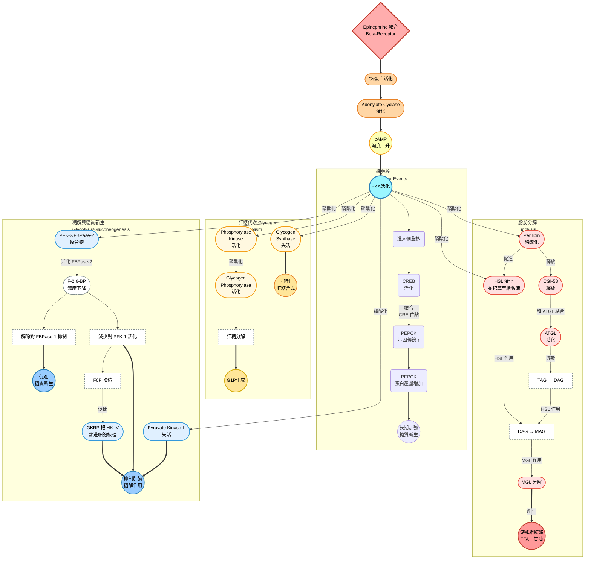

## W10: cell signaling
### signaling molecules and their receptors
- 細胞訊號傳遞通常跟受體 (receptors) 以及配體 (ligands) 有關係，促進一系列的細胞內反應
- 調控的反應包含但不限於: 細胞代謝、移動、分化跟增值

#### 細胞跟細胞間間的信號種類
- 上一次提到的整合素 (integrins) 以及鈣黏蛋白 (cadherins) 除了作為細胞黏附跟固定的作用之外，也跟細胞內的訊號傳遞有關係
- 這個訊號反應可以為細胞跟細胞間，或是細胞跟胞外基質間

> [!Note]
> cell-cell之間的黏附關係可以為desmosome或是adherens junction，而這些junction不只是黏附，也會互相傳訊息 🐱

#### the action of secreted signaling molecule
- 訊號傳遞的方式通常可以分成三種: 
  - **endocrine signaling** (內分泌)
  - **paracrine signaling** (旁分泌)
  - **autoctine signaling** (自分泌)

    

- endocrine的訊號傳遞ligand被稱為激素 (hormones)，作用在距離分泌細胞較遠的目標物，通常透過循環系統運送
- paracrine的兩個細胞間通常距離很短，ligand透過擴散的方式傳遞，例如兩個神經源之間利用 neurotransmitters傳遞訊息
- autoctine就式分泌細胞跟接受的目標細胞皆來自於同一個細胞，例如T cell利用cytokine自我活化

#### 脂溶性或是小分子訊號的傳遞
- 對於可以直接穿過細胞膜的激素，其受體通常就是位於細胞質內部，甚至在細胞核內部
- 這些分子要麼屬於脂溶性，要麼屬於小分子型，因為他們都能直接穿過細胞膜

#### steroid hormone
- 這些激素通常是屬於小分子的疏水性激素，例如固醇類，能夠跟目標細胞內的轉錄因子結合
- 固醇類激素包含一些性激素 (如estradiol、testosterone、progesterone)，或是糖皮質激素 (如cortisol)、醛固酮 (aldosterone) 等等

    

#### glucocorticoid action
- 糖皮質激素會先擴散過細胞膜，並且跟細胞質內的糖皮質激素受體結合
- 通常來說，該受體會跟Hsp90結合，但是在受體跟糖皮質素結合後，會導致構型改變
- 受體連著激素一起脫離Hsp90，並且兩個受體形成二聚體 (dimers)，通過核孔
- 該二聚體識別某個DNA上的位點，招募 **"共同活化物" (coactivator)** ---- 組蛋白乙醯基轉移酶 **(histone acetyltransferase, HAT**)，並和其結合，刺激該目標DNA的轉錄

    

#### thyroid hormone
- 甲狀腺素和類固醇激素一樣屬於 "脂溶性激素"，不過它在結構上完全不是類固醇，因為它實際上為tyrosine的衍生物，含有**碘修飾的芳香環結構**
- 其分子依然有辦法直接穿過細胞膜，甲狀腺素進入細胞後，會先被去碘酶轉換成T3 (T3的活性比T4強)
- 甲狀腺素的受體位於**細胞核內部**，平常就在DNA的識別位點上面待著，無論有沒有激素結合上去
- 激素受體在沒有激素分子的情況下，會跟**histone deacetylase (HDAC)** 結合，這東西能抑制該基因轉錄，屬於 **"共同抑制物" (corepressor)**
- 一旦甲狀腺素出現在細胞核內，跟受體結合後，會導致構型改變，受體改跟HAT結合，促進基因表現

#### 其餘的小分子訊號傳遞
- 一氧化氮 (nitric oxide, $NO$ )，屬於一種旁分泌訊號分子，在神經、免疫跟循環系統中扮演功能，由於它分子很小而且屬於氣體，一樣能輕鬆穿過細胞膜
- 它主要作用於**鳥甘酸環化酶 (guanylyl cyclase)**，促進第二信使**cGMP**生成。cGMP有促進血管平滑肌鬆弛的效果
- **nitroglycerin**主要治療與預防心絞痛，其屬於硝酸鹽類血管擴張劑，可以迅速在體內轉化成一氧化氮

> [!Tip]
> - cGMP在作用後會被磷酸二酯酶 (phosphodiesterase, PDE) 分解，因此能夠抑制PDE，使cGMP可以在細胞中停留較長時間的藥物也有類似效果
> - 這些PDE抑制劑 (如 Viagra, Cialis) 不可以跟nitroglycerin併用，會有血壓過低的風險 🐱

    

#### 肽類化合物跟生長因子
- 有一大類的信號傳遞分子屬於peptides，包含: 
   - **肽類激素 (peptide hormones)**，例如促胰液素 (secretin)、胰島素 (insulin)
   - **神經肽 (neuropeptides)**，如內啡肽 (endorphins)、血管收縮素 (vesopressin)、催產素 (oxytocin)
   - **多肽的生長因子 (polypeptide growth factors)**，例如表皮生長因子 (epithelial growth factor, EGF)
- 這些分子都屬於水溶性，而且無法通過目標細胞的細胞膜，所以這些分子的受體往往就位於細胞膜上面
- 生長因子信號的失調可能導致癌症等疾病

### G protein and cyclic AMP
#### G蛋白偶聯受體的長相
- G protein-coupled receptor (GPCRs) 是一大類膜蛋白受體的統稱，這種受體的共同點就是其立體結構中都有七個跨膜 $\alpha$ -helix，且其上頭都有G蛋白 (aka鳥苷酸結合蛋白) 的結合位點
- 細胞內部的domain具有鳥甘酸交換因子活性 (GEF)，可以影響G蛋白的狀態
- 該受體很常出現於視覺、嗅覺、味覺訊號傳遞，也常常是中樞神經的神經傳遞物受體

> 大家可以點擊以下影片來看看喔~ 👀
> 

#### regulation of G protein
- GPCR原本與異三聚體G蛋白 ( $\alpha$ 、 $\beta$ 、 $\gamma$ 三個次單元）結合， $\alpha$ 次單元連接著GDP
- 當激素結合受體時，該受體會**刺激G protein釋放GDP**，換成GTP，導致 $\alpha$ -GTP跟 $\beta\gamma$ 分離，分別去調控不同的下游路徑，例如: 
  - $G_s$ 路徑: **活化腺苷酸環化酶 (adenylyl cyclase) → 產生cAMP → 活化PKA → 促進酵素磷酸化**
  - $G_q$ 路徑: **活化磷脂酶C (PLC) → 產生** $IP_3 + DAG$ **→ 釋放** $Ca^{2+}$ **、活化PKC**
  - $G_i$ 路徑: **抑制adenylyl cyclase → 抑制cAMP產生 → PKA活性下降 → 降低酵素磷酸化**

    

- cAMP在此處為第二信使 (second messenger)，第一信使 (first messenger) 就是結合GPCRs的配體
- PKA (蛋白激酶A) 分為兩個結構: 
  - **催化次單元 (C-subunit)**，負責磷酸化他人
  - **調控次單元 (RIIα-subunit)**，上頭可以結合兩個cAMP
  - PKA磷酸化後，釋放的C次單元會去繼續磷酸化其他酵素
- 作用完之後，**RGS蛋白**會水解GTP，導致 $\alpha$ 亞基失去活性，成為 $\alpha$ -GDP後跟 $\beta\gamma$ 再次結合，回復初始狀態

#### 肝糖分解
- glucagon跟epinephrine等激素作用時，就是促進 $G_s$ 路徑，活化的PKA釋放C次單元，活化**磷酸化酶 (phosphorylase)**，促進肝糖分解成葡萄糖-1-磷酸，供細胞使用
- 同時磷酸化**肝糖合成酶 (glycogen synthase)**，使其失活，抑制肝糖合成

#### 基因表現
- 游離的C次單元也會進入到細胞核中，磷酸化轉錄因子CREB (cAMP response element-binding protein)，促進基因表達

#### 磷酸化的調節
- protein phosphatases (蛋白質磷酸酶) 主要有PP1、PP2A、PP2B (calcineurin) 等。它們會移除磷酸基，終止或逆轉原本的PKA訊號

#### 備註: $\beta$ -receptor的活化反應總整理

### tyrosine kinase
- 酪胺酸激酶也是一大酵素連結性的受體家族，它可以磷酸化自己受質蛋白質上的酪胺酸殘基
- receptor tyrosine kinase (RTK) 常常是許多polypeptide growth factor的受體，例如胰島素受體就是一種RTK

#### receptor tyrosine kinase, RTK
- 由兩條跨膜蛋白組成，每一條都是N端在胞外，C端在胞內，每一條中間僅有單一的跨膜 $\alpha$ -helix，C端附近就是酪胺酸激酶的活性域
- 生長因子結合到RTK時，會促進兩條蛋白二聚化 (dimerisation)，形成二聚體的RTK會自發磷酸化 (autophosphorylation)，兩條跨膜蛋白會 "互相幫對方磷酸化酪胺酸殘基"
- 一旦受體磷酸化，其就可以讓下游的蛋白質跟受體結合。含SH2 domain或PTB domain 的蛋白 (如Grb2、PI3K) 會專門辨識磷酸化的tyrosine，並且活化

    

#### nonreceptor tyrosine kinase, NRTK
- 由於沒有跨膜結構，所以不能直接感知外部配體，常常得要依靠RTKs或其他受體招募到細胞膜，然後被活化
- 例如，當RTK在配體結合後二聚化並自發磷酸化時，這些磷酸化位點吸引Src family kinases、Abl、FAK等NRTKs。NRTKs會進一步磷酸化其他受體或adaptor proteins
- 有時，RTK與NRTK之間互相磷酸化，形成正回饋

> [!Note]
> ##### Src 結構
> - 包含kinase domain (SH1)、SH2 domain、SH3 domain、C端尾
> - 非活化時，C端尾的Tyr527被磷酸化，SH2 domain會固定在這個離酸化的位點，整個蛋白質呈現折疊的樣子，kinase domain的活性位點周圍形成一個loop，導致其他底物無法跟這個位點結合
> - 活化時，Tyr527去磷酸化，SH2 domain不再被鎖住，kinase domain上的loop被自我磷酸化後會打開，暴露活性位點 🐱

