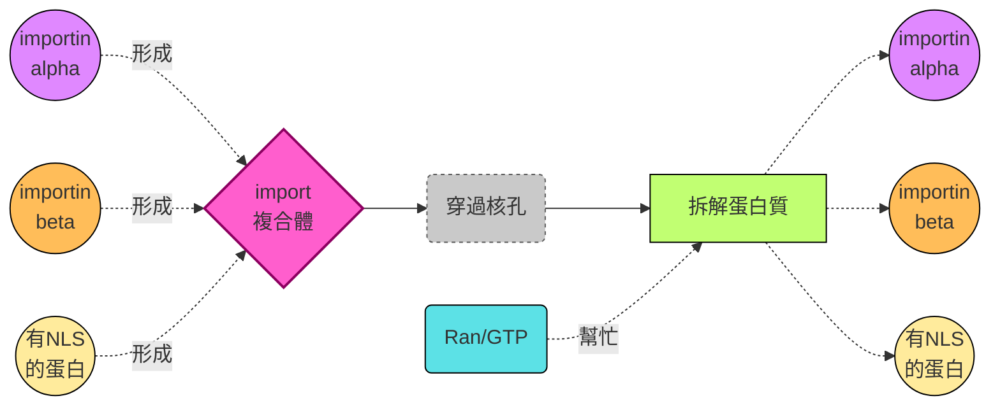
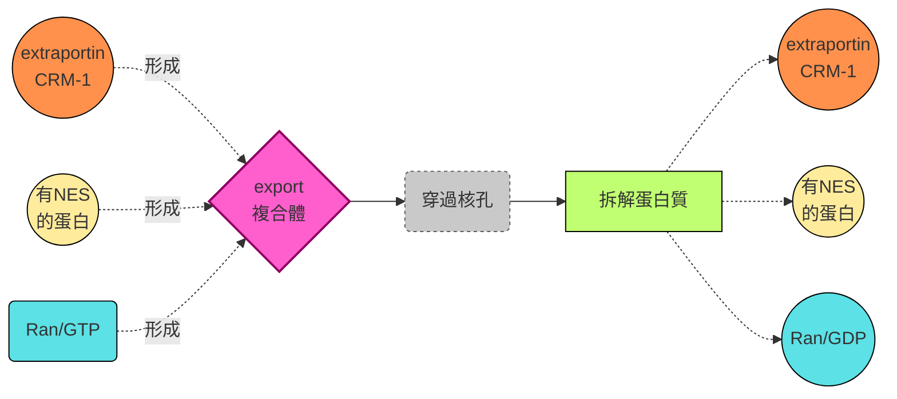
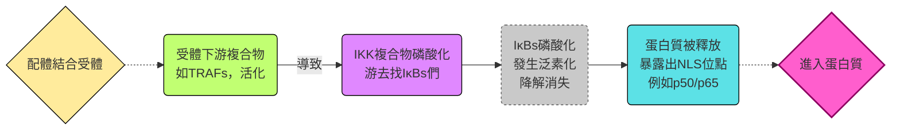

## W2: The Nucleus
### 簡介
- 在原核生物中，一條mRNA的轉錄跟轉譯同時進行。細胞核的出現將轉錄跟轉譯分開，其中:
  - 轉錄在細胞核中進行
  - 轉譯在細胞質中進行
#### structure
- 兩個細胞膜，包含outer and inner membranes、核纖層 (nuclear lamina)、核孔 (屬於複合蛋白，又稱為nuclear pore complex)

#### membranes
- 作為細胞核跟細胞質的barriers。只有小的，非極性的分子可以通過
##### outer membrane
- 外膜跟內質網 (endoplasmic reticulum, ER) 連結在一起
- 內膜跟外膜中間的空間被lumen (也就是膠質溶液) 佔據
- 表面有ribosomes佔據
##### inner membrane
- 上面蛋白質很多，有各種整合膜蛋白 (integral membrane proteins)
- 可以跟各種東西 (包含核纖層) 作用
#### nuclear lamina
- 為一種有系統的網狀結構，分佈於核模內側，作為細胞核支持用
- 由核纖蛋白組成 (lamins)，核纖蛋白形成的多肽鏈會兩條纏在一起，形成二聚體 (dimer)

- 核纖層連結到很多東西
  - 透過LINC蛋白質複合體接到細胞骨架
  - 透過脂質修飾把自己黏在內膜上
  - 連接內膜蛋白質例如emerin跟核纖蛋白B受體
  - 同時也連接染色體或是染色質，影響基因表達的空間分布，並參與轉錄與表觀遺傳調控
- 合成核纖層蛋白A跟C的基因會導致遺傳疾病，包含肌肉營養不良 (muscular dystrophies)、心肌病變 (cardiomyopathies)、脂肪營養不良 (Lipodystrophy)、早衰 (progeria) 等等
  - 最常見的就是Hutchinson-Gilford Progeria Syndrome (HGPS)，異常的 Lamin A 蛋白累積。導致患者表現出加速老化的特徵。
 
>[!Tip]
> 細胞核牆壁不穩 → 細胞功能異常

#### 核孔複合物
- 讓帶有極性的小分子、離子跟大分子通過的地方，由30種不同的孔蛋白 (nucleoporins, NUPs) 組成，形成八重的對稱結構

##### 三大部分包含
- 核環 (nuclear ring): 位於核膜內側，連接核纖層。　
- 細胞質環 (cytoplasmic ring): 位於核膜外側，與細胞質相連。
- 中央通道 (central channel): 中間的孔洞，分子通過的主要路徑。
> [!Note]
> 這個通道裡面並不是完全空的，裡面有FG-NUPs，作為傳輸的調控

##### 纖維結構
- 細胞質側有 "細胞質纖維" (cytoplasmic fliament)，像觸手一樣伸向外部，幫助捕捉運輸蛋白。
- 核內側有 "核籠" (nuclear basket)，像籃子一樣懸掛在孔下方，協助分子選擇與調控。

##### mechanisms
- 穿過核孔有兩大方式: 
  - 被動的擴散作用: 小的分子量的分子 (通常小於四萬道爾頓)，可以直接隨心所欲穿過去
  - 選擇性運輸: 大分子透過特定的信號辨認
> 接下來我們會針對選擇性運輸來了解一下... 🐱

--- 

### Selective Transport
#### 核定位訊號
- nuclear localisation signals (NLSs) 屬於一段**蛋白質上面的特殊胺基酸序列**，存在於需要進入細胞核的蛋白質上。
- 它的作用就像通行證，讓運輸蛋白 (importins) 能夠辨識並攜帶這些蛋白質通過核孔，進入細胞核。
##### examples
- 第一個NLS是在SV40 T antigen (猿猴病毒40的T抗原) 上發現
- nucleoplasmin有NLS，由兩部分胺基酸序列組成。中間的10個胺基酸如果突變，並不會影響importins對該NLS的辨識能力

#### 過程
##### 1. 蛋白質攜帶 NLS
- 蛋白質上有一段 NLS (aka 核內通行證 ✨)

##### 2. Importin 辨識 NLS
- Importin $\alpha$ : 專門辨識並結合 NLS
- Importin $\beta$ : 負責與核孔複合體互動，帶著整個複合物靠近核孔
> [!Tip]
> 這兩者組成 "保安 + 導遊" 團隊。🙋

##### 3. 通過核孔複合體（NPC）
- Importin $\beta$ 與 NPC 的蛋白質互動，讓整個複合物進入中央通道。
- 蛋白質被護送穿過核孔，進入細胞核。

##### 4. Ran-GTP 協助釋放
- 在核內，Ran-GTP (一種小型的GTP結合蛋白) 與 Importin $\beta$ 結合，促使蛋白質釋放。
- Importin $\alpha$ 也在核內被其他因子 (如 CAS/Ran-GTP) 帶回細胞質。
> [!Tip]
> Ran-GTP 就像核內的接駁車司機，確保保安團隊完成任務後能回到細胞質。🚌

##### 5. Importin 循環再利用
- Importin $\alpha$ 跟 $\beta$ 被運回細胞質，準備下一次的運輸。
- Ran-GTP 在細胞質中被水解成 Ran-GDP，完成能量循環。

##### 6. Ran 跟 Nuclear Transport Factor 2
- Ran-GDP 需要回到核內，才能再次被「充電」
- Ran-GDP 本身沒有 NLS，不能直接進入核孔。它依靠核輸入因子2 (NTF2) 作為 "專屬運輸員"
- NTF2 能辨識 Ran-GDP，並攜帶它通過核孔複合體進入細胞核。

##### 7. Ran-GEF
- 進入核內後，Ran-GDP 在 RanGEF (RCC1) 的作用下，將 GDP 換成 GTP，轉換成 Ran-GTP。
- Ran-GTP 就能再次參與蛋白質釋放與運輸循環。

#### 核輸出信號
- 又稱為NES, Nuclear Export Signal
- 依樣畫葫蘆，有輸入，就有核輸出。有importin，就有exportin
#### 步驟如下
##### 辨識 NES 
- Exportin 專門辨識蛋白質上的核輸出訊號 (通常是由疏水性胺基酸，如 leucine) 組成的短序列

##### 與 Ran-GTP 協同作用 
- 在核內，Exportin 需要與 Ran-GTP 一起結合有 NES 的蛋白，形成三元複合體。這個複合體才能被NPC認可並輸出到細胞質

##### 釋放機制 
- 到達細胞質後，Ran-GTP 被水解成 Ran-GDP，導致複合體解離，蛋白質被釋放到細胞質中

##### 其餘蛋白回收 
- Exportin 和 Ran-GDP 則透過 NTF2 (對又是它) 回到核內，準備下一輪輸出

#### 來做一個小總結
##### 傳入細胞核

##### 傳出細胞核

##### 蛋白質位置

|位置|蛋白質名稱|
|---|---|
|核外，細胞質|Ran/GDP,RanGAP,NTF2,Importin|
|核膜上面|FG-NUPs|
|核內|Ran/GTP,RanGEF,Exportin|

#### RNA運輸
- 很多非編碼RNA會在細胞核中工作，因此他們也要運出去運進來
##### snRNA
- 參與mRNA剪切，可以透過exportin Crm1被運出去
- snRNA接下來就跟各種蛋白質結合，形成複合物snRNPs
> [!Tip]
> snRNA + protein = snRNPs

- 然後被一種importin，也就是snorportin，帶回細胞核

##### others RNAs
- tRNA and miRNA的輸出有其它的exportins
- rRNA跟ribosomal proteins結合，跟snRNA一樣，利用Crm1被運出去
##### mRNA
- **它們不用Ran，有自己一套運出細胞的方法**
- 載運師之前，mRNA會跟多種被招募的蛋白質形成複合物
- 位於細胞質那一側，核孔附近的的RNA解旋酶會重塑複合物，移除上面的蛋白質，釋放mRNA
#### 核蛋白輸入的調控
- 原本的轉錄因子 $NF-\kappa B$ 跟 $I\kappa B$ 在一起，屬於非活化狀態，因為 $I\kappa B$ 會把NLS位點蓋住，讓importin偵測不到
- 在某些訊號下， $I\kappa B$ 會被磷酸化，導致其被降解，這時NLS位點出現，讓importin偵測到

--- 

### Inside the Nucleus
#### Chromosome territories
- 染色質並非隨機分布，各個染色體的著絲點跟端粒會落於核膜的兩端，並且各自雄霸一方

#### 轉錄活性
- 真染色質 (Euchromatin) 比較鬆散，在間期的細胞裡面轉錄很多。通常位於核孔附近
- 異染色質 (Heterochromatin) 比較密集，高度濃縮，不具轉錄活性，通常在核仁附近
- 不需要的基因，或是高度重複的序列 (例如端粒跟著絲點)，常常形成異染色質
- 通常，轉錄因子跟RNA聚合酶會聚集在細胞核內一處，他們在這裡大量為某部分染色質進行轉錄，又稱為transcription factories

#### nuclear bodies
- 他們是細胞核內，多種沒有外膜的離散胞器。具體來說，它們是由蛋白質和 RNA 聚集形成的功能性區域，屬於動態的結構域。包含:

|nuclear body|數量|功能|
|---|---|---|
|nucleolus|1~4|最大、最顯眼的核小體，負責 rRNA 的轉錄與核糖體亞單位的組裝|
|Cajal bodie|0~10|參與 snRNA 與 snoRNA 的加工與修飾，幫助剪接體 (spliceosome) 的組裝|
|PML bodies (ND10)|10~30|與 DNA 修復、基因調控、抗病毒反應、細胞命運控制以及腫瘤抑制有關。PML 基因突變會導致急性早幼粒細胞白血病|
|Speckles|20~50|富含剪接因子，與 mRNA 剪接與加工有關，snRNP在Cajal body組裝為壁就會被送到這裡來|

