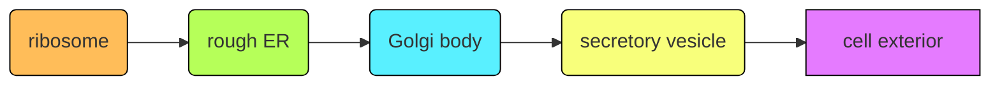
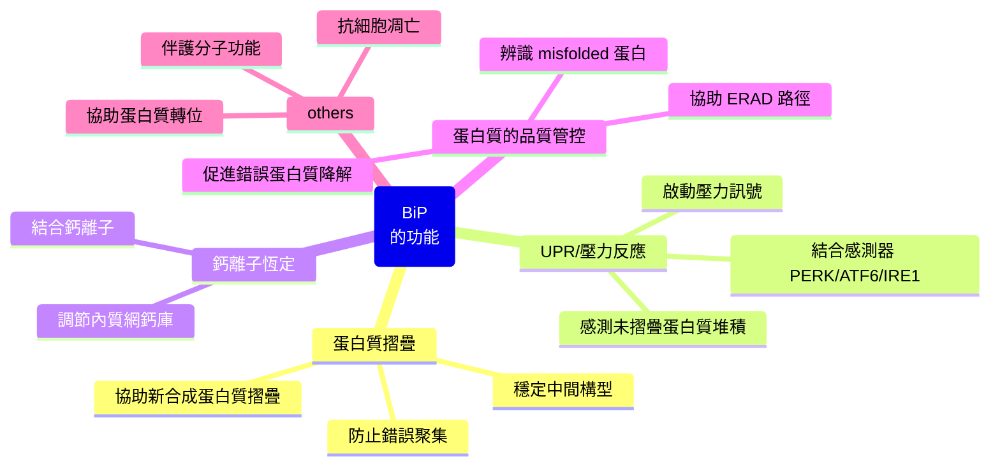
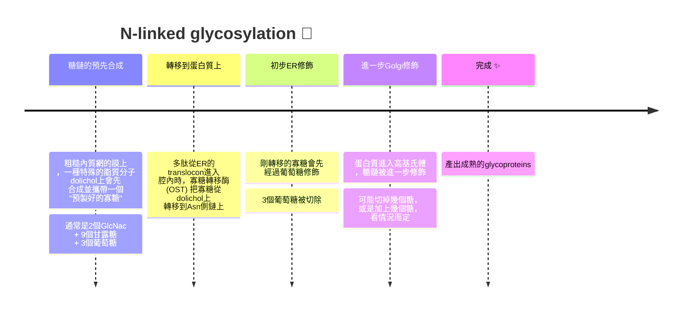

## W3: Protein Sorting and Transport I
### 分泌途徑跟內質網
#### the secretory pathway
- 蛋白質的分泌途徑是由George Palade跟他的同僚在1960年代提出，利用胰腺細胞首次描繪出蛋白質從核糖體到內質網、高基氏體、囊泡到分泌出去細胞的途徑: 

>[!Note] 
>這讓他獲得1974年的諾貝爾獎 🐱

#### 分泌途徑的拓譜學
- 內質網 (endoplasmic reticulum, ER) 內部 (ER lumen) 其實對應到的是細胞外部
- 假如說有一個蛋白質鑲嵌在**內質網的內側**，他將會分泌時鑲嵌於**高基氏體的內側**，並且在分泌時鑲嵌於**細胞膜的外側**
- 反之，鑲嵌於**內質網外側**的蛋白質，會出現在**高基氏體的外側**，並且鑲嵌在**細胞膜內側**

#### 蛋白質的分泌目標點
- 根據核糖體的位置，分為free ribosomes (在細胞質裏面漂浮的核糖體) 跟 membrane-bound ribosomes (連接到ER的核糖體)

|type|free ribosome|membrane-bound ribosome|
|----|-------------|-----------------------|
|目的地|前往細胞核、粒線體、葉綠體、過氧化體等非內膜系統的胞器|前往各種膜 (例如核膜或是過氧化體膜)，以及內膜系統胞器 (包含高基氏體、溶體、細胞膜等)|

- 大部分的穿膜蛋白就是透過傳輸囊泡 (transport vesicles) 走這種內膜系統的分泌路徑
- 如果這個蛋白質是要給核膜的，那這鑲嵌的蛋白質會沿著內質網的膜移動到核膜上面
- 基本上有三分之一的細胞蛋白質，都是ER負責加工
> [!Tip]
> 記得，內質網跟核膜外膜本來就是連在一起的 ! 👀

#### 到底ER是個啥
- 一個網狀的，由封閉的膜形成的管狀或是囊狀構造 (在內膜系統中，囊狀構造又被稱為**cisternae**)
- 屬於核膜外膜的延伸
- 真核細胞裡面最大的胞器 (通常啦)
- 表面積非常大 (其膜的表面積就佔了整個細胞含有的膜的一半)
- 分為**粗糙內質網 (rough ER)** 或是**光滑內質網 (smooth ER)**

> [!Important]
> 粗糙內質網表面附著核糖體，主要負責蛋白質修飾 (processing)
> 光滑內質網表面沒有核糖體，主要進行脂肪跟有毒分子的代謝

---

### 粗糙內質網的功能
#### 分泌蛋白質的步驟說明 

##### 1. ribisome starts to translate
- mRNA 與核糖體結合，開始合成多肽鏈。 
- 若這段蛋白質帶有 signal peptide (或是signal sequence)，它會在翻譯初期被合成出來

##### 2. signal recognition: the function of SRP
- signal peptide會被signal recognition particle (SRP) 偵測到。
- SRP暫停核糖體的翻譯，並引導核糖體-多肽複合體靠近粗糙內質網膜

##### 3. connection: SRP receptors and translocon
- 核糖體-SRP複合體與SRP受體結合在粗糙內質網膜上
- 接著核糖體會對接到translocon (Sec61 蛋白複合體，一個內質網上面的跨膜通道)

##### 4. co-translational translocation
- 當核糖體繼續翻譯時，新生多肽鏈會直接通過translocon進入ER腔，或嵌入ER膜
- 這個過程稱為共轉譯轉運 (co-translational translocation) 

##### 5. the removal of signal peptide
- 若蛋白質是分泌型的蛋白，訊號胜肽通常會被訊號肽酶 (signal peptidase) 切除
- 多肽鏈繼續延伸，並開始折疊

##### 6. post-translation modification
- 在ER腔內，蛋白質會進行轉譯後的修飾 (例如disulfur bond的形成)
- 如果有錯誤折疊的蛋白質，會被ER辨識並送去降解

> [想要看3D動畫的可以點這裡喔 👀](https://www.youtube.com/shorts/aM-B-9FTZIE)

---

#### membrane protein
- 有些蛋白質並不是被分泌出去細胞的，而是鑲嵌在膜上面的，這被稱為穿膜蛋白 (transmembrane proteins)
- 因此，轉譯的蛋白質不會進到lumen，而是會被鑲嵌到ER的膜上面，隨著囊泡融入細胞膜時，一起被鑲嵌到細胞膜上面執行功能
- 等下會介紹四種類型，分別是:
   - 🟡**帶有可切割訊號序列的膜蛋白**
   - 🔴**透過內部跨膜序列嵌入細胞膜的膜蛋白**
   - 🟣**有多個嵌入的序列的膜蛋白**
   - 🔵**先轉譯，後插入的膜蛋白**

> 來開始一個一個介紹吧... 🙂

#### 🟡 帶有可切割訊號序列的膜蛋白 (cleavable signal sequences)
- 轉譯出的多肽會帶有signal sequence，當多肽從translocon進入並穿過膜時，這一段多肽會被signal peptidase切割掉，多肽的N端進入內質網內
- 當轉譯出一堆疏水性的序列時，多肽會先**暫時停止進入內質網內**
> [!Note]
> 根據胺基酸的R group，有些胺基酸是屬於疏水性的，有些屬於親水性。疏水性的胺基酸通常偏好脂質的膜，這就是為什麼他們能穩定鑲嵌於脂雙層內部的原因。
> 通常在二級結構， $\alpha$ -helix都會嵌入膜中，整個螺旋就會由很多疏水性的胺基酸組成 (ง •_•)ง

- 然後整段的疏水性序列會被translocon **"推" 到脂雙層的膜中**，讓疏水性區域的多肽鑲嵌到膜上面
- 最後轉譯完成，穿膜蛋白形成，N端位於ER的lumen裡面，C端在細胞質中

> [!Tip]
> N端在內，C端在外，有信號序列，有signal peptidase 🟡

#### 🔴 透過內部跨膜序列嵌入細胞膜的膜蛋白  (via internal transmembrane sequences)
- 共有兩個類型: I型跟II型

##### type I
- 如果這個多肽鏈沒有signal sequence，轉譯時，N端不會成功進入內質網裡面 (也就是說，**這時多肽鏈並沒有穿過translocon**)，SRP這時就會出手，跟疏水的序列做結合，然後**幫忙把該疏水序列嵌入內質網膜中**
- 這種情況屬於I型
- 疏水序列被推到脂雙層的膜中，而多肽鏈繼續轉錄，經過translocon，最後轉錄完成，這時，多肽鏈的C端進入內質網，N端在細胞質中

> [!Tip]
> N端在外，C端在內，沒信號序列🔴

##### type II
- SRP 幫忙把疏水序列嵌入內質網膜的時候，如果會引導N端進入內質網，那就屬於II型
- 轉錄完成後，N端在ER裡面，C端留在細胞質中

> [!Tip]
> N端在內，C端在外，沒信號序列🔴

#### 🟣有多個嵌入的序列的膜蛋白 (span the membrane multiple times)
- 疏水的跨膜序列被 "推" 入脂雙層膜後，核糖體繼續轉錄
- 要是其間又遇到了一個疏水的跨膜序列，那就再 "推" 一次
- 要是嵌入了兩個跨膜序列，兩個序列中間的多肽會形成一個loop
- 然後以此往復，有多少個疏水序列，就 "推" 幾次...

> [!Tip]
> 跨膜疏水域不只一個的時候出現 🟣

#### 🔵先轉譯，後插入的膜蛋白
- 有時候即使核糖體沒有結合到內質網上面，其轉譯的蛋白質也會變成跨膜蛋白
- 當轉譯接近終點時，如果C端出現疏水跨膜序列，當多肽被釋放到細胞質時，GET3蛋白會出現並捕捉該多肽鏈
> [!Warning]
> 如果疏水序列出現在細胞質或是lumen裡面，該段分子會**因為疏水效應而自動聚集**、纏繞在一起，這是屬於錯誤摺疊 ! 😮

- GET3是一種ATP結合蛋白，會專門辨識並且結合到疏水跨膜區域
- GET3-蛋白複合體會被導向ER膜上的GET1/GET2複合體
- 在ATP水解的驅動下，蛋白的跨膜區域被鑲嵌進內質網膜，形成正確的跨膜蛋白定位
- 這又被稱為**GET pathway**

> [!Tip]
> N端在外，C端在內，核糖體沒結合到ER，尾錨型蛋白🔵

#### 對照表來看一下 🗂️

| 類型 | 訊號序列位置 | 是否可裂解 | 嵌入方式 | 常見蛋白 |
|------|--------------|------------|----------|----------|
| 可裂解訊號序列 | N 端 | ✅ | SRP → translocon幫忙嵌入 | 分泌蛋白 |
| 不可裂解訊號序列 | N 端或內部 | ❎ | SRP幫忙嵌入 → 錨定膜 | 單次跨膜蛋白 |
| 多個跨膜序列 | 多個疏水片段 | ❎ | 多次進出 translocon | GPCR、通道蛋白 |
| 尾錨型 | C 端 | ❎ | GET pathway → ER 膜 | SNARE、尾錨蛋白 |

#### 備註: hydropathy plot
- Hydropathy plot是一種用來分析蛋白質序列的工具，它會根據每個胺基酸的親水性或疏水性指數，繪製出整條多肽鏈的 "親疏水性分布圖"
- 由科學家Kyte跟Doolittle在1980年代發明。具體的圖長相大概就是: 
> X軸為第n個胺基酸 (從N端算起)，Y軸為疏水值，畫成一條曲線，然後標出平均線 ✨
- 最後呈現出來的圖，就會出現高高低低的鋒值。通常，**每一個高峰，也就是比較疏水的區域，代表的就是一個跨膜的序列!**
- 要是plot上面有7個鋒，那就可能是GPCR (例如血清素受體5-HT2A，7個 $\alpha$ -helix )，要是有12個鋒，那就可能是轉運蛋白 (例如GLUT1，12個 $\alpha$ -helix)

### 蛋白質的摺疊跟修飾
#### what is BiP?
- Bip，aka Hsp7 (heat shock protein 70)，是一類分子伴侶 (chaperone)，在細胞中扮演 "摺疊助理" 的角色，特別是在蛋白質合成、運輸與壓力反應時會出來幫忙
- 在轉譯時，BiP可以跟轉譯出的多肽結合，幫助多肽鏈折疊成蛋白質
- 如果蛋白質面臨變性的風險，他們可以跟這些蛋白質結合，不僅可以防止它們不正常聚在一起，甚至可以幫助蛋白質變回正確結構
> [!Note]
> 之所以被稱為叫做Hsp70，是因為它分子量有70 kD (千道爾頓)。除此之外，Hsp還有很多種，例如Hsp60、Hsp90等等 🐱

#### 糖基化 glycosylation
- 在內質網中，蛋白質會跟醣類做鍵結。通常會在蛋白質的Asn殘基上面接上糖鏈 (這又被稱為N-linked glycosylation)
- 步驟大致如下:

- by the way，糖基化其實還有分成N型跟O型:

|類型|N-連接型糖基化 (N-linked glycosylation)|O-連接型糖基化 (O-linked glycosylation)|
|---|---|---|
|特色|糖鏈附著在天冬醯胺 (Asn) 的側鏈上|糖鏈附著在絲氨酸 (Ser) 或蘇氨酸 (Thr) 的-OH基上|
|形成的位置|起始於ER，之後在Golgi進一步修飾|主要在Golgi進行|
|常見於|分泌蛋白和膜蛋白|黏蛋白 (mucins)|

#### GPI (glycosylphosphatidylinositol) 的添加
- GPI是一種特殊的脂質結構，可以作為一種 "錨" 把蛋白質固定在細胞膜外層 ⚓
- 通常，原本有跨膜序列的蛋白質是被嵌入在ER的膜上面的
- 在ER腔內執行GPI的錨定時，疏水序列會被特定酶切除。蛋白質因此失去原本的跨膜區域
- 預先合成好的GPI結構 (磷脂 + 糖鏈組成) 會被 GPI transamidase接到蛋白質C端。
- 當蛋白質最後被送到細胞膜外層時，它就靠GPI錨固定，而不是跨膜的疏水域 !

