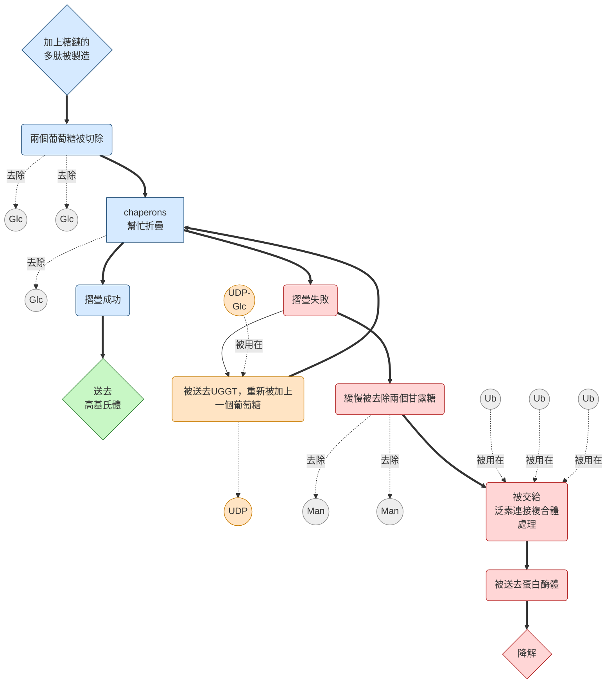
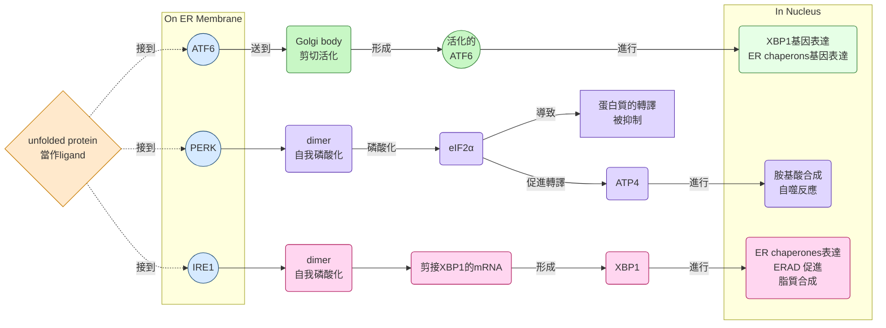
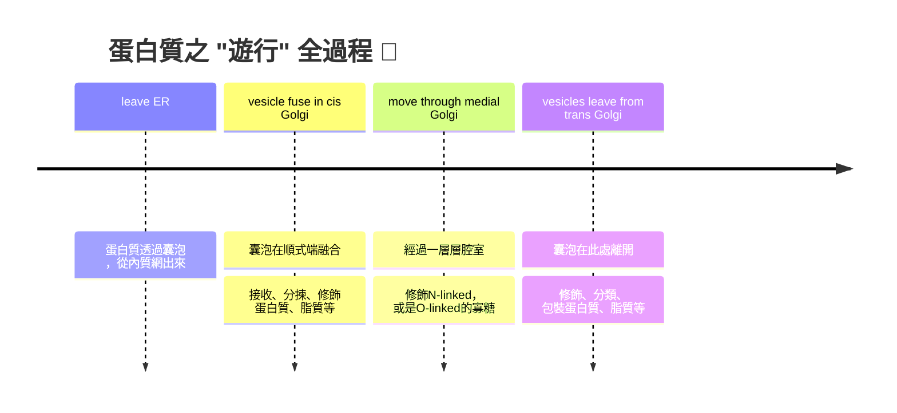
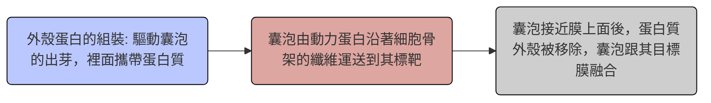

## W4: Protein Sorting and Transport II
學號: 4113052130 科系: 生科2 姓名: 徐詠智
### before we start this class...
- translocon其實是一種複合物，由多個蛋白質domains組成
- 結構上有一個側面開口，可能是讓疏水序列被 "推出" translocon的原因
- 如何決定在internal transmembrane sequence在做出蛋白質時是N端or C端?

> [!Tip]
> 在跨膜螺旋附近，帶正電的胺基酸 (如Lys, Arg) 傾向留在細胞質側。

### the rough ER
#### 前情提要
1. 分泌型蛋白會先進入ER
2. 離開ER前，蛋白質會被摺疊好
3. 伴侶分子會幫助摺疊蛋白質
4. 如果蛋白質還沒有被摺疊好，蛋白質會被保留在ER lumen裡面
5. 如果蛋白質無法被修復，會被帶去分解 (可能利用泛素化、蛋白酶體)
6. 如果太多蛋白質累積於細胞裡面，會引發壓力反應 (例如導致apoptosis)

#### ERAD (ER介導的降解流程)
- 糖蛋白進入ER後，會被chaperones進行折疊，並且被切除一個葡萄糖
- 摺好的蛋白質會被囊泡帶去運輸
- 但是如果摺疊失敗，UGGT蛋白會把原本的葡萄糖接回去，再重新摺疊一次

> [!Tip]
> 那要是這蛋白質已經爛透了呢? 🙂
> 那就是直接當垃圾丟掉 !

- misfolding (例如疏水區域暴露太多，蛋白質扭成一團)，蛋白質會被切掉兩個mannose，並且被帶到泛素連接複合體 (ubiquitin ligase complex)，接著被進行泛素化，並且被蛋白酶體 (proteasome) 降解

#### UPR (未摺疊好的蛋白質反應)
- 長期的，不正常的蛋白質聚集，會導致壓力反應
- 主要受到三種壓力偵測影響
- 基本中心法則都一樣: 

$$\boxed{protein\  misfolded}\Rightarrow\boxed{response}\Rightarrow\boxed{transcription}$$

> 以下將一一介紹... 🐱

##### AFT6 pathway
- 🔴感測方式: ATF6是一個膜蛋白，平時停留在ER膜上面
- 🔵啟動機制: 當ER壓力增加，ATF6 會被送到Golgi，在那裡被剪切成活化型
- 🟣作用: 活化的ATF6進入細胞核，促進chaperones和品質控制基因的表達，幫助蛋白質正確折疊

##### PERK pathway
- 🔴感測方式: PERK是ER膜上的kinase
- 🔵啟動機制: 壓力下，PERK (一種Ser/Thr 激酶) 二聚化，並自我磷酸化
- 🟣作用: 磷酸化 $eIF2\alpha$，抑制整體蛋白質翻譯，減少新生蛋白進入ER。同時促進ATF4的翻譯 (ATF4進入細胞核，調控抗壓基因與自噬、代謝相關基因)

##### IRE1 pathway
- 🔴感測方式: IRE1也是ER膜上的感測器
- 🔵啟動機制: 壓力下，IRE1二聚化 (和PERK一樣) 並活化其RNase活性
- 🟣作用: 剪接XBP1的mRNA (切除26個核甘酸)，產生活化型XBP1蛋白。XBP1進入細胞核，促進 蛋白質折疊、降解 (就是促進ERAD路徑 !!) 和脂質合成相關基因的表達。

> [!Tip]
> PERK、IRE1的活化機制有點像是蛋白酪胺酸激酶PTK，因為它也會自我磷酸化，形成二聚體，但是他們是完全不一樣的東西 !! 😮

- 如果這些改變都無法滿足蛋白質折疊到原樣，那就會進行程序性細胞死亡 (aka apoptosis)

#### 最後再提醒一次:

|what if|result|
|-------|------|
|蛋白質尚未摺疊好|待在ER裡面直到摺疊好|
|蛋白質無法被修復|ER介導的蛋白質分解，ERAD|
|累積太多蛋白質|未摺疊好的蛋白質反應，UPR|
|無藥可救只能打掉重練|程序性細胞死亡，apoptosis|

---

### the smooth ER
#### 所有膜的脂質來源
- 真核生物的細胞膜由三種脂質組成: 磷脂質 (phospholipid)、糖脂質 (glycolipid)、膽固醇 (cholesterol, W8)
- 膜脂質基本上是在smooth ER合成，新合成的脂質會跟舊的脂質混合在一起 (還記得鑲嵌模型吧? 👀)

#### 合成步驟
##### 1. 初步合成
- 新合成的磷脂質會在內質網的 "細胞質側" 形成
> [!Note]
> 請記住內膜系統的胞器基本上都是脂雙層結構 💪

##### 2. Translocation
- 新的脂質在其中一層脂質層上面流動著，但是要記得，一部份的脂質會被翻轉到內質網側，通常是利用phospholipid flippase

> [!Tip]
> - **Flip = 指脂質分子從外層 → 內層的移動**
> - **Flop = 指脂質分子從內層 → 外層的移動**

##### 3. 增加膜的面積
- 兩層的脂質分子數量漸漸平衡，導致膜的面積增加

---

### the Golgi apparatus
- 一種由好幾層囊狀構造 (腔室，cisternae) 疊加在一起的胞器，周圍偶有圍繞著幾顆囊泡 (像是pancake 一樣 🫓🫓🫓)
- 有兩極:*cis* 跟 *trans*，中間被稱為medial
- 蛋白質從 *cis* 端進入，從 *trans* 端出來，在其間，蛋白質會經過每一層腔室，逐漸修飾至成熟
- 有些囊泡會載著蛋白質，回到上一層腔室，以重新利用

#### 糖基化 glycosylaton
- 糖基化有非常多功能，例如:
  - N-linked glycosylation可以幫助蛋白質正確折疊。
  - 醣鏈能被分子伴侶辨識，協助折疊與品質檢查
  - 若折疊失敗，醣基化也能標記蛋白質進入 ERAD (這個剛剛有討論過了 🐱)

##### N-linked oligosaccharides
- 之前在ER那邊加上的糖，會在Golgi裡面近一步修飾跟修剪
- 至於怎麼個修飾法... 請自行看看以下 👀

##### O-linked oligosaccharides
- O-鍵結的醣基化基本上只在Golgi裡面進行，醣類會在絲氨酸 (Serine) 或是蘇胺酸 (Threonine) 這種帶有 $-OH$ 基團的胺基酸上面進行，形成醚鍵，也就是:

$$GalNAc-O-Ser$$

#### 其他Golgi的功能
- 溶酶體蛋白在Golgi也會被糖基化，但是其N-linked寡糖跟其他的分泌型蛋白不太一樣
- 主要是透過在一個甘露糖上面再加上一個M6P (甘露糖-6-磷酸) 來target
- 除了糖基化，Golgi也會合成脂質，例如合成glycolipids (糖脂質) 以及sphingomyelin (鞘磷脂)

#### 蛋白質如何被分類跟輸出
- 蛋白質在*trans*-Golgi network (TGN) 裡面進行分類，透過囊泡運輸到最終目的地
- 內體 (類似囊泡的中繼站, Endosome) 的種類有不同種:

|Early endosome (早期內體)|Late endosome (晚期內體)|Recycling endosome (回收內體)|
|---|----|---|
|剛形成，pH 還不太酸|pH 更酸，結構更複雜|專門負責把受體或膜蛋白送回細胞膜|
|主要功能是 "分揀": 受體通常會被回收回膜，配體則可能留下來|與溶酶體逐漸融合，準備降解內容物|例如transferrin receptor的回收|

- 蛋白質可以直接運送到質膜
- 也可以用recycling endosome運送到質膜
- 也可以進行所謂的 "分類"，以進行調控

#### 囊泡運輸的機制
- 囊泡會在不同的sacs裡面進行運輸
- 囊泡上面覆蓋了一層蛋白質 (cytosolic coat protein)
- 囊泡的行程跟運輸機制如下:

- 上面覆蓋的蛋白質有很多種，例如**COPII、COPI、Clathrin**

#### 🌀 三大 coat protein 家族
1. **COPII (Coat Protein Complex II)** 
   - **來源**: ER → Golgi
   - **功能**: 負責將新合成的蛋白質從 ER 運送到 Golgi
   - **特色**: 由 Sar1 GTPase 啟動，組裝 Sec23/24 與 Sec13/31 複合體
   
2. **COPI (Coat Protein Complex I)** 
   - **來源**: Golgi → ER (retrograde transport)，以及 Golgi 內部的分層運輸。 
   - **功能**: 回收 ER 蛋白 (例如帶 KDEL 序列的蛋白)，維持 Golgi 的結構 
   - **特色**：由 ARF1 GTPase 啟動。 
   
3. **Clathrin-coated vesicles** 
   - **來源**: 可以是Trans-Golgi → endosome/lysosome，或是Plasma membrane → endosome (endocytosis) 
   - **功能**：負責選擇性運輸，例如帶有 mannose-6-phosphate 標記的酵素送往溶酶體
   - **特色**：由 clathrin 三腳架 (triskelion) 組成，常與adaptor proteins (AP complexes) 協同

> 想看看COPII的囊泡形成動畫，可以[點這裡看看喔 👀](https://www.youtube.com/watch?v=ABGlD1vQG3s)

#### 囊泡跟膜的融合 🐱
1. **囊泡運送到目的地**
   - 囊泡表面有 Rab GTPases，它們像 "地址標籤"，幫助囊泡找到正確的膜
   - Rab 與 tethering factors (錨定蛋白) 互動，讓囊泡靠近目標膜

2. **SNARE 蛋白的辨識與配對**
   - 囊泡上的 v-SNARE (vesicle SNARE) 與目標膜上的 t-SNARE (target SNARE) 結合
   - 它們纏繞在一起，形成一個「四股螺旋束」，像拉鍊一樣把兩個膜拉近
3. **膜融合**
   - 當膜距離足夠近，脂雙層會重新排列，形成融合孔
   - 囊泡內容物釋放到目的地 (例如 ER、Golgi、溶酶體或細胞膜外)

4. **輔助蛋白**
   - NSF 與 SNAP 幫助解開 SNARE 複合體，讓 SNARE 可以再利用。

---

### lysosome
- 溶體是一種膜狀胞器，有各種不同的酵素在裡面，能夠分解各種不同的分子或是聚合物，包含蛋白質、核酸、脂質、醣類等等
>[!Tip] 
> 相當於細胞自己的消化系統 🤔

- 裡面的酵素多數偏好酸性環境，屬於酸性水解酶。為了維持pH=5的酸鹼值，需要主動運輸質子到溶體裡面

#### autophagy 細胞自噬
- 溶體除了分解各種小分子或是聚合物，也可以消化細胞的胞器，這種自己消化自己的過程就叫做自噬
- 自噬有時噬生物發育的重要過程，或是在壓力下的一種反應
- 通常發生在細胞開始感受到飢餓的時候。它們開始分解譯西不必要的大分子或是胞器，並且重新利用分解後的產物
- 自噬跟程序性細胞死亡 (apoptosis) 也有關係

#### 內吞作用跟溶體的關係
- 細胞外分子透過吞噬或是胞飲作用把物質帶進細胞裡面。這些物質會用囊泡包起來
- 這些內吞細胞會跟early endosome融合
- 由於這些囊泡上的受體需要重新回收到細胞膜表面，early endosome會出芽上面有受體的囊泡給recycling endosome。recycling endosome會把受體再重新分配到細胞膜上面
- 同時early endosome成熟為late endosome，接收那些上面有M6P糖基化蛋白質的囊泡

> [!Note]
> 還記得嗎? 被標記Mannose-6-phosphate糖蛋白的囊泡，就是負責水解的，裡面有酸性水解酶 ! 💪

- late endosome最後跟有水解酶的囊泡融合，形成溶體

#### 一張圖片總結 👀

    

