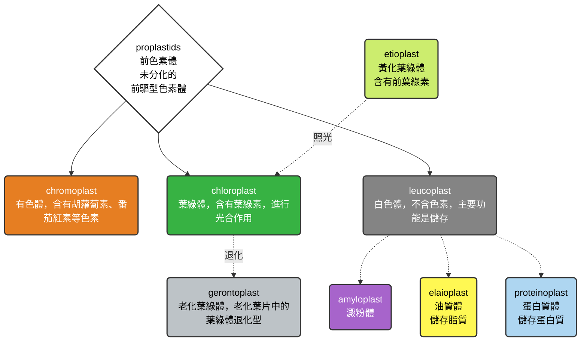
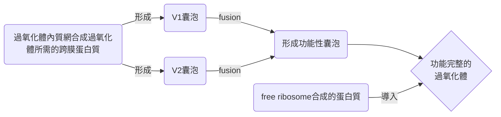
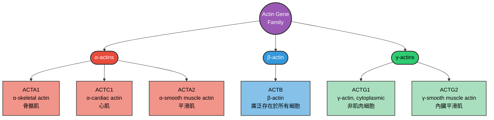
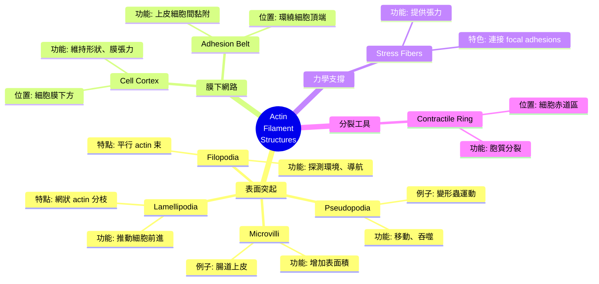

## W6: Mitochondria, Chloroplasts, and Peroxisomes II

### chloroplast
> 讓我們繼續上完那還沒有結束的葉綠體... 🙂

#### 關於如何進入類囊體膜
- 接下來會介紹三種路徑: Tat pathway、Sec pathway、SRP pathway

#### Tat pathway
- 葉綠體的類囊體上有 Tat pathway，它負責把一些需要在基質中先折疊好的蛋白質，送進類囊體腔
> [!Note]
> 又稱為Twin-arginine translocation pathway，因為蛋白質的信號序列上面有兩個精氨酸 (arginine)

- SST1跟SST2跟蛋白質結合，並且將蛋白質送到Tat complex上面
- SST1跟SST2跟complex結合後，就會釋放蛋白質，使蛋白質能通過Tat complex
- 該complex的運輸能量來源是**依靠質子梯度**，而非ATP
- 進入類囊體腔之後，TPP (thylakoid processing protease) 會分解掉信號序列

> [!Important]
> 這種運輸方式可以運輸一整個已經摺疊好的蛋白質，不需要以多肽鏈的形式才能進入類囊體腔 👀

#### Sec pathway
- 在類囊體上，附著於Sec translocon的SecA可以辨識訊號序列
- 多肽鏈 (在Hsp70的保護下) 通過Sec translocon，同時會消耗一個ATP
- 同樣，進入類囊體腔之後，TPP會分解掉信號序列
- 除此之外，如果該多肽屬於跨膜蛋白，Sec translocon也會幫忙把蛋白質 "推" 到類囊體膜上面

#### SRP pathway
- 有些膜蛋白來自於基質裡面的核糖體本身製造的，這些形成的多肽上有訊號 欲裂，會由cpSRP (hloroplast signal recognition particle) 辨識出來，引領整條多肽來到類囊體膜上的Alb3蛋白體
- Alb3會幫忙把多肽 "推" 到類囊體膜上面

| 特徵 | **Tat pathway** | **Sec pathway** | **SRP pathway** |
| --- | --- | --- | --- |
| **名稱由來** | Twin-arginine motif (RR) 訊號序列 | Sec 蛋白複合體 (secretory) | Signal Recognition Particle (SRP) |
| **運輸對象** | 已折疊好的蛋白質 (常含金屬輔因子) | 未折疊的多肽鏈 | 在葉綠體基質新合成的多肽鏈，特別是膜蛋白或分泌蛋白 |
| **能量來源** | 質子動力勢 | ATP 或 GTP | GTP |
| **訊號序列特徵** | N端有 RR motif | 一般N端訊號肽 | N端有疏水訊號序列 |
| **運輸方式** | 整個折疊好的蛋白質打包送過去 | 未折疊的多肽逐步穿過膜 | 核糖體合成時即被 SRP 偵測並導向膜上的受體 |
| **生物學意義** | 確保含金屬中心，或複雜結構的蛋白質，能夠正確折疊後再運輸 | 提供大部分分泌蛋白，或膜蛋白的運輸途徑 | 負責將新生蛋白直接導入膜或 ER，避免錯誤定位 |

#### plastids
- 色素體or質體，是一種類型的植物胞器。共通點就是: **它們有跟葉綠體一模一樣的基因組**
- 但是在結構跟功能上有很大的不同，各有差異
- 所有的色素體都是來自於proplastid (原色素體)

##### 種類分析
- 通常分類方法就是看看它裡面到底有甚麼樣的色素，通常分為以下:

### peroxisome
- 由單一膜狀構造形成的胞器，沒有核糖體跟DNA
- 可以自行分裂複製，而且可以在細胞中迅速再生
- 裡面的蛋白質是典型的真核生物的蛋白質

#### 作用簡介
- 過氧化體會進行氧化反應，並且產生過氧化氫 ( $H_2O_2$ )
- 由於過氧化氫對身體有害，因此過氧化體裡面有過氧化氫酶 (又被稱為catalase)，可以把過氧化氫分解成水，或是透過過氧化氫來氧化另一種有機化合物
- 可以分解很多東西，例如尿酸、胺基酸、嘌呤、甲醇跟脂肪酸

#### 氧化脂肪酸所扮演的角色
- 在過氧化體裡，脂肪酸氧化的第一步是由由acyl-CoA oxidase催化，這個酶直接把電子傳給氧氣，結果生成 $H_2O_2$

- 在大多數生物裡面，脂肪酸可以被粒線體跟過氧化體氧化。通常來說，過氧化體會先分解較長鏈的脂肪酸，等到其脂肪酸鏈較短時，才透過carnitine來進入粒線體
> [!Note]
> 差別在於，粒線體的脂肪酸氧化會把高能電子傳給 $FADH_2$ ，而過氧化體會把電子直接傳給氧氣，導致 $H_2O_2$ 的形成

- 在酵母菌跟植物裡面，脂肪酸的分解就只依賴於過氧化體

#### 過氧化體的組裝

##### V1 類囊泡
- 來源: 由**ER**出芽形成
- 特徵: 攜帶過氧化體膜蛋白，提供過氧化體的膜組成
> [!Tip]
> 相當於「建築材料」，先把膜結構送到過氧化體的生成區域 🐱

##### V2 類囊泡
- 來源: 由粒線體出芽形成
- 特徵: 攜帶部分過氧化體所需的蛋白質或脂質
> [!Tip]
> 相當於「裝潢材料」，補充過氧化體內部所需的成分 🐱

##### 另類途徑
- 新的過氧化體也可以透過舊的過氧化體 "分裂" 形成

---

## W6: The Cytoskeleton and Cell Movement I
### short introduction
- 細胞骨架為細胞提供結構跟框架，作為支架決定細胞的形狀跟胞器位置
- 也可以在細胞運動，或是囊泡運輸上面扮演角色
- 主要分為三種細胞骨架:
  - **microfilaments** (actin)
  - **microtubules **(tubulin) 
  - **intermediate filaments** (Keratin, Vimentin, Desmin, Neurofilaments, Lamins, etc)

### microfilaments
#### actin
- 肌動蛋白，在許多真核生物裡面，含量都很豐富
- 通常會位於細胞膜內層附近
- 哺乳動物一共有6個轉譯actin的基因，這些基因通常都高度保守，如下: 

#### 組裝過程簡介
##### 核心的形成跟延伸
- 首先，actin會先形成二聚體或是三聚體，然後開始在兩端一個一個組裝上去，最終形成一個有plus端跟minus端的聚合物

> [!Tip]
> 有點像先形成一個 "種子" 之後，開始向兩端生長

- plus端生長快，minus端生長慢
- 要是actin上面接上了ATP (我們在此稱它ATP-actin)，它會更容易聚合。這些ATP-actin會不斷往plus端添加
- 添加期間，在actin filament的中間區域，一些接上ATP-actin產生ATP水解，變成ADP-actin
- 接上ADP的actin比較不穩定，會從聚合物上脫落，也就是說，minus端的actin會一個一個脫落

> [!Note]
> - 這就造成了一個有趣的現象: plus端一直接上actin，minus端一直失去actin，使整個actin分子呈現動態流動的現象
> - 這又被稱為 "跑步機現象" (Treadmilling) 🐱

- microfilament可以透過一些方式來穩定結構，例如:
  - capping proteins: 可以附著在microfilament的兩端，避免其分散開來
  - tropomyosin: 沿著actin filament的溝槽排列，覆蓋在actin上
> [!Note]
> - 在肌肉細胞中，tropomyosin也與troponin複合體協同作用
> - 當 $Ca^{2+}$ 結合 troponin 時，tropomyosin會移開，暴露actin 上的myosin結合位點
> - 這樣myosin才能與actin結合，使肌肉收縮

- 除此之外，actin-binding protein也可以跟好多個microfilament結合，使纖維形成網狀的結構

#### 組裝過程: a closer look
- profilin首先會跟actin單體結合，使其成為ATP-actin
- ATP-actin在formin dimer的幫助下，逐漸聚集在一起，形成絲狀結構
- Arp2/3負責讓microfilament "分支"，它會結合在plus端，讓actin聚合時形成分支
- cofilin負責 "切斷" microfilament，使其變成兩條纖維，兩條纖維的末端都會形成新的plus端跟minus端

| 蛋白質 | 主要功能 | 機制特色 |
| --- | --- | --- |
| **Formins** | 促進成核與延伸 | 幫助 actin 單體聚合，維持正端快速延伸 |
| **Arp2/3** | 分枝成核 | 在既有 filament 上建立分枝，形成網狀結構 |
| **Profilin** | 加速延伸 | 將 ATP-actin 裝載到正端，促進聚合 
| **Cofilin** | 拆解 filament | 結合 ADP-actin，促進負端解聚 |
| **CapZ** | 封住正端 | 阻止正端延伸，控制 filament 長度 |
| **Tropomyosin** | 穩定 filament | 沿 filament 排列，防止解聚，並調控 myosin 結合 |

#### 細胞膜跟microfilament
- microfilament形成的網路會附著在細胞膜下方，這個結構又被稱為actin cortex
- 由actin filament交織成網狀，並與膜蛋白 (例如integrins) 及接蛋白 (如spectrin，血影蛋白) 相互作用
- 整個網路由ankyrin (錨蛋白) 固定在細胞膜內側，ankyrin同時跟spectrin，以及跨膜蛋白band 3結合
- 還有一些連結，是跟蛋白質4.1有關。它會把microfilament跟spectrin連接到細胞膜上的glycopgorin

- 功能包含:
  - 維持細胞形狀 
  - 細胞運動，例如偽足 (filopodia) 的形成
  - 胞吞/胞吐作用中，actin網路幫助膜的凹陷與囊泡形成。
  - 機械支撐，抵抗外力，保持膜張力

#### 微絨毛究竟是什麼
- 有些細胞上面 (例如小腸的上皮細胞)，會在一極處形成許多凸起
- 這些突起跟細胞運動、吞噬作用，或是物質的吸收有關係。而最有名的，就是由microfilament形成的微絨毛 (microvilli)
- 微絨毛是屬於細胞膜的延伸，這大大增加了細胞膜的表面積
- 一個小腸上皮細胞上面，可能就有大概一千多個微絨毛，增加其吸收乳糜中營養的能力

- 還有一種特殊的microvilli，位於耳朵裡面的毛細胞。毛細胞上的纖毛會偵測耳蝸裡面液體的震動，來產生聽覺

#### 微絨毛結構分析
- 其骨架由actin filament所支持，纖維聚集成束，纖維跟纖維之間由絨毛蛋白 (villin)、纖毛蛋白 (fimbrin) 跟纖絲蛋白 (epsin) 交聯形成
- actin filament由肌球蛋白I (myosin I) 附著在細胞膜上面，而纖維底部由肌球蛋白VI (myosin VI) 固定
- actin filament的plus端剛剛好就是位於微絨毛的末端，上面由cap protein覆蓋
- 而minus端 (也就是微絨毛底部) 就固定在spectrin形成的網路上面

#### myosin跟actin的愛恨情仇 💔
- myosin能夠利用ATP，將化學能轉換成機械動能
- myosin跟actin在很多地方都會互相合作，包含細胞分裂、肌肉收縮、囊泡運送等等

#### 細胞運動
- 透過這些細胞膜底下的網路延伸出去，就能夠形成各式各樣的細胞移動方式，延伸的構造包含:

|structure|Pseudopodia (偽足)|Lamellipodia (片狀足)|Filopodia (絲狀足)|
|---------|-----------|------------|---------|
|長相|寬廣、不規則的突出|薄片狀、寬廣的膜突出|細長如絲般的指狀突起|
|功能|細胞運動 (變形蟲運動)、吞噬作用|比較像是細胞在基質上爬行時的 "前導邊緣"，推動細胞向前|像 "感測器"，探索環境、偵測化學訊號，幫助細胞決定移動方向。|

#### 細胞遷移
##### 1. 延伸出去
- 突起的延伸 (無論是pseudopodia、lamellipodia還是filopodia) 會先出來
- 通常是filopodia先延伸出來探索

##### 2. 黏附
- 細胞延伸的區域附著在其要經過的基質上面

##### 3. 後端收縮
- 細胞前端利用延伸的突起附著在基質上後，細胞後端會脫離基質，"縮" 回細胞裡面去

#### 最後的最後來個總結吧 🙂

