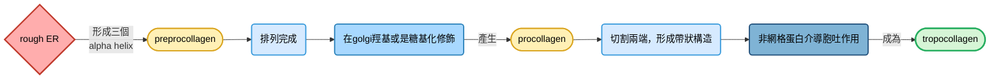
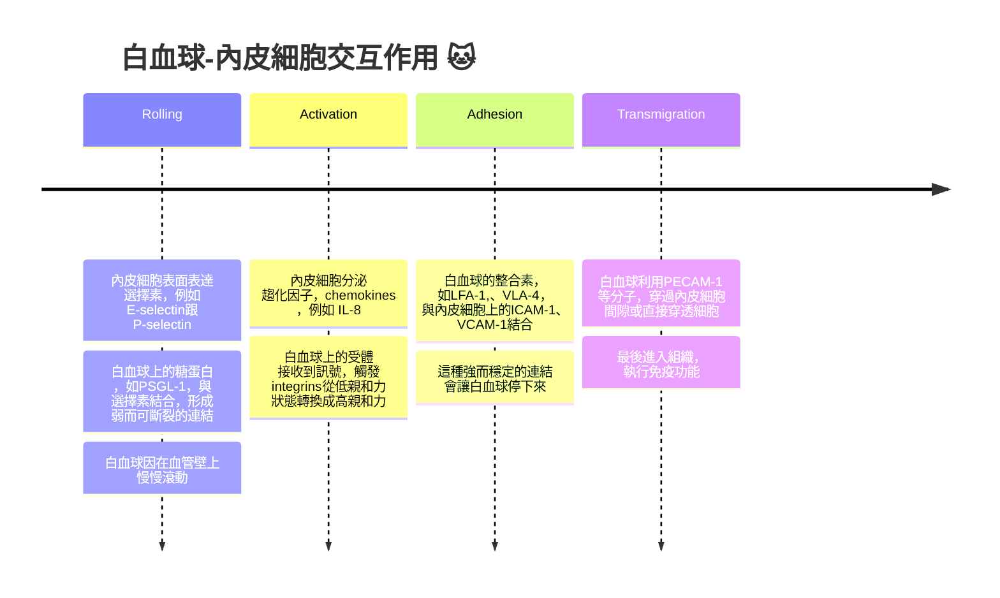

## before we start the class... 👀
### active transport (延續上周)
#### 小腸上皮細胞的葡萄糖轉運
##### in the apical domain...
- 利用 $Na^+$ 的梯度從小腸腸腔獲取葡萄糖
- 每一次葡萄糖調細胞裡面，就會連帶兩個 $Na^+$ 進到細胞中，葡萄糖被吸收後就聚集在上皮細胞裡面

##### in the basolateral domain...
- 葡萄糖之後會透過促進性擴散，被轉到上皮細胞下的結締組織以及微血管床裡面

#### the ATP-binding cassettes transport
- 屬於一種高度保守的跨膜蛋白，存在於幾乎所有的真核生物和原核生物中
- 可以做為輸入 (例如帶入營養物質)，也可作為輸出 (例如帶出有毒物質)
- 由四個區域組成: 兩個ATP結合域，兩個跨膜蛋白域
- 每個跨膜蛋白域由六個 $\alpha$ -helix組成

## W9: The plasma membrane II, Cell walls, the extracellular matrix and cell interactions
### cell walls
#### 細菌的細胞壁
- 細胞壁可以跟滲透壓形成一種 "抵抗" 的效果，同時決定不同種類細菌細胞的特徵跟形狀
- 細菌的細胞壁由peptidoglycan (肽聚醣) 組成
- 肽聚醣由兩種糖聚合而成: NAG (N-acetylglucosamine) 跟 NAM (N-acetylmuramic acid)
- NAM上面會接上胺基酸 (例如順序可能是L-Ala、D-Glu、meso-DAP、D-Ala、接上另一個聚合的糖)
- 糖骨架通常是螺旋型的，也可能會在兩個胺基酸鏈中間再出現interbridge (Gly鏈形成) ，形成由短肽鏈形成的cross-links

> [!Note]
> penicillin抑制形成cross-links的酵素，導致細胞壁不堅固，使細胞破裂

    

#### 真核生物的細胞壁
- 很多真核生物都有細胞壁，其細胞壁由多糖組成
- 例如真菌的細胞壁由chitin (甲殼素) 組成，藻類跟高等植物的細胞壁由纖維素組成

> [!Note]
> 甲殼素同時也形成節肢動物門 (arthropods) 的外骨骼

    

#### plant cell wall
- 纖維素 (cellulose) 跟半纖維素 (hemicellulose) 交錯形成，並且被果膠 (pectin) 包圍
- 纖維素由微纖維 (microfibrils) 組成，微纖維形成 "層狀排列"
- 半纖維素為多分支的多糖，透過氫鍵跟microfibrils結合，穩定microfibrils，形成堅韌的纖維
- 周圍的果膠能夠鎖住水分，形成膠狀的感覺
- 除此之外，醣蛋白 (glycoprotein) 也有參與到結構支持的作用

    

- 半纖維素跟果膠由高基氏體合成並分泌出去，而纖維素透過細胞膜上的跨膜蛋白 "纖維素酶" 合成
- 纖維素酶利用細胞質中的UDP-葡萄糖作為底物，將葡萄糖分子一個接一個地連接成 $\beta$ -1,4 葡聚糖鏈，最後組裝成堅固的纖維素微纖絲

> [!Warning]
> 持續生長的纖維素一直都是跟纖維素酶連在一起的，沒有分開 !! 👀

    

#### expansion of plant cell
- 植物跟細菌並沒有讓自己跟外界的滲透壓保持平衡，由於細胞質滲透壓往往較大，水會傾向從細胞外流入細胞內
- 細胞內部的壓力會促使細胞內容物往細胞壁緊靠 (壁咚的概念?) 
- 這是維持植物組織剛性跟結構的關鍵因素，又稱為膨壓 (turgor pressure)，植物細胞就能僅僅透過吸收水分使細胞膨脹，而無須形成新的細胞質成分
- 這種擴張就能使細胞發育時，體積增長速度變快

> [!Important]
> 細胞中的液泡 (vacuole) 會因為水分子進入而變大，但是細胞質的體積沒有變化 !! 🤔

### the extracellular matrix
#### what is the ECM
- 動物的細胞往往浸泡在細胞外基質 (extracellular matrix, ECM) 中，也促進細胞跟組織的連結。ECM在結締組織 (connective tissue) 中尤為常見

    

- 基底層 (basal laminae) 是一種支持上皮細胞層的結構，基底層同時也會無圍繞著肌肉細胞、脂肪細胞以及周邊神經系統
- 基底層以下為疏鬆結締組織 (loose connective tissue)，其含有大量的ECM，這些ECM由纖維母細胞 (fibroblast) 分泌
- ECM通常包含膠狀的多糖類、纖維狀的蛋白質絲、以及固定細胞於ECM的黏接蛋白 (adhesion proteins)

#### matrix polysaccharides
- 這些纖維蛋白絲周圍往往環繞著不同的多糖，例如糖胺聚糖 (glycosaminoglycans, GAGs)

    

- GAGs主要負責抓住水分，形成膠狀質地。其中，唯一一個以單一長型多醣鏈型式存在的GAGs，就是玻尿酸 (又稱為透明質酸，hyaluronan)
- 玻尿酸的合成是透過膜上面的波尿酸合成酶產生 (跟纖維素的合成地點有點像耶 👀)
- 蛋白聚醣 (proteoglycans) 就是一條核心的多肽鏈上面接了好多個GAGs分子，這些蛋白聚醣跟玻尿酸產生作用，形成非常大型的複合體

    

#### matrix structural protein
##### what is collagen
- 膠原蛋白是屬於ECM中最常見的結構性蛋白之一，由三條蛋白質多肽形成的 $\alpha$ -helix纏繞而成
- 其中，多肽鏈為每三個胺基酸中，就有一個是glycine，形成以下結構: 

$$\cdots -\boxed{glycine}-\boxed{X\ amino\ acid}-\boxed{Y\ amino\ acid}-\boxed{glycine}-\boxed{X\ amino\ acid}-\boxed{Y\ amino\ acid}-\cdots$$

- 其中，X胺基酸或是Y胺基酸往往可能是proline跟hydroxyproline

##### type I collagen
- 最常見的膠原纖維，合成該collagen fibrils時，會先形成可溶性的前驅物分子 (被稱為procollagen)，然後分泌到細胞外面後再形成gap

##### type IV collagen
- 屬於網狀樣貌的膠原蛋白，相對於type I collagen來說，更加有彈性

|collagen種類|特色|
|---|---|
|**type I**|最粗，抗張力最強，出現在真皮層、骨頭、肌腱|
|**type II**|比第一型細很多，主要在軟骨中出現|
|**type III**|網狀結構很多，形成網狀纖維，支持各種器官 (例如肝臟、脾臟、淋巴結、骨髓、血管壁)|
|**type IV**|沒有帶狀結構，不形成纖維束，而是形成一片 "網格狀" 的薄膜，位於基底膜|
|**type V**|在胎盤裡面很多|

#### adhesion protein
##### fibronectin
- 纖連蛋白是一種二聚體 (dimer) 的多肽鏈，兩條多肽鏈在接近C端的地方由兩個雙硫鍵連接在一起
- 上面有一些位點，給蛋白聚醣、integrins、膠原纖維等物質結合

    

##### laminins
- 層粘連蛋白就是基底層的主要黏接蛋白，是一個十字架形狀的，由 $\alpha$ 、 $\beta$ 、 $\gamma$ 亞基形成的 "異三聚體" (heterotrimers，也就是三個亞基結構並非相同的三聚體)
- 能夠自我組裝成網狀結構，上頭一樣有給蛋白聚醣、integrins結合的位點

##### nidogen
- 巢蛋白可做為laminins跟type IV collagen之間的連接媒介。nidogen既可以跟laminins結合，也可以跟type IV collagen結合
- 這讓laminins、nidogen、collagen、蛋白聚醣們可以連在一起，形成基底層的交連網路

##### elastic fiber
- 如同彈簧一樣，可以拉伸到一定程度，然後也可以在拉伸後回復原狀。例如，肺部的擴張就是因為有了彈性纖維的 "回彈功能"

#### cell-matrix interaction
- 細胞跟ECM的連接是由細胞的跨膜蛋白integrins (整合素) 負責
- integrins是一種 "異二聚體" (heterodimers)，由兩個亞基 $\alpha$ 跟 $\beta$ 組成，$\alpha$ 亞基能跟二價陽離子結合 (divalent cation)
- integrins可以跟collagen、fibronectin、laminin、以及蛋白聚醣形成連結
- 細胞伸出偽足移動的時候，就是透過integrins跟基質形成連結的。細胞質內的actin filament會透過其他蛋白質 (如 $\alpha$ -actinin、vinculin、talin等) 錨定到integrins的 $\beta$ 亞基上面

- 半橋粒也是透過 $\alpha 6 \beta 4$ integrins跟基底層連結，讓上皮細胞可以牢牢固定在上面。而內部，中間絲也透過plectin掛勾在integrins上面
### cell-cell interactions
#### adhesion junctions
- 細胞間的adhesion是特異性或是選擇性的，跨膜蛋白cell adhesion molecules負責做這種特異性選擇
- cell adhesion molecules包含selectins、integrins、immunoglobulin家族、以及cadherins等等

##### leukocytes and endothelial cells
- 白血球在遷移的時候會黏在血管內皮細胞上面。這個黏附主要是由白血球上的integrins以及內皮細胞的ICAM蛋白交互作用形成的

##### cadherins
- 鈣黏蛋白形成穩定的細胞間連結，有高度保守的胞外結構，主要介導的是 "同型交互作用"
- 在**adhesion junction**中，cadherins讓一個細胞的actin filaments可以跟另一個細胞的actin filaments連接起來
- 在**desmosome**中，兩種desmosome的鈣黏蛋白 (desmoglein跟desmocollin) 讓兩個細胞的中間絲能夠連接在一起
#### tight junctions
- tight junction主要 "封住" 上皮細胞之間的空間，形成一個障礙，分開並且分開細胞膜apical跟basolateral區域
- 屬於最近、黏得最緊的junction (但是兩個細胞膜並未融合)
- 它由相鄰細胞上的一個個排成好幾排的跨膜蛋白組成，這些跨膜蛋白也會連結細胞中的actin filaments

    

#### gap junctions
- 在單一組織中，細胞由gap junction相互連結，它屬於一種跨膜蛋白通道
- 連接通道被稱為連接子 (connexons)，由六個connexins亞基組成
- 允許水跟離子，以及小於1000 kD的物質運輸
- gap junction的開關受到**鈣離子**以及pH值的調控
- 在代謝、訊息傳遞以及電訊號反應中扮演重要角色，讓一群相互連接的細胞可以一起協調 

    

#### plasmodesmata
- 屬於植物細胞間的adhesion，由細胞壁負責，而不是細胞膜上的跨膜蛋白
- 細胞壁中富含果膠的地方被稱為中膠層 (middle lamella)，把兩個細胞黏在一起
- 但是在plasmodesmata中，鄰近細胞的細胞膜是連在一起的，讓分子可以在植物細胞間傳遞。例如傳遞轉錄因子、miRNAs等調控基因表現的物質
- 通常，內質網的延伸部分會通過plasmodesmata
- plasmodesmata屬於動態的結構，中間的通道可以根據刺激而打開或是關閉

    

